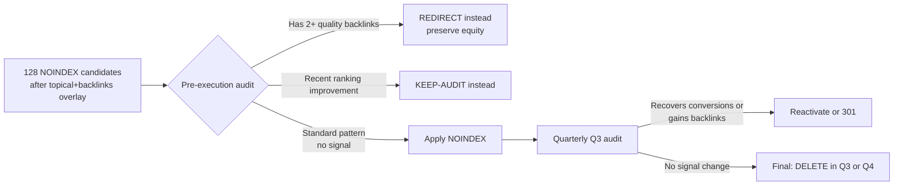
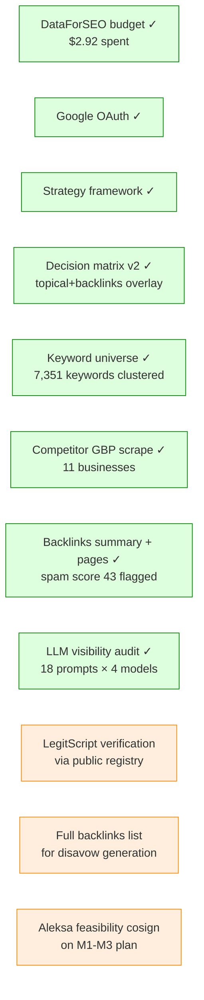

# Surfpoint Recovery — Q2 2026 Custom SEO Strategy

**Client:** Surfpoint Recovery (Inpatient Drug & Alcohol Rehab & Detox)
**Address:** 2316 Surf Avenue, Brooklyn NY 11224 (Coney Island)
**Strategy cycle:** Q2 2026 — first quarterly cycle under HQDM's strategy-first reporting rollout
**Owner:** Aleksandar Spasevski, Head of Search Intelligence
**Feasibility cosignature:** Aleksa Popovic (On-Page lead)
**Date:** 2026-05-08
**Status:** Draft pending Aleksa feasibility pass

---

## Executive Summary

> **Surfpoint owns the Brooklyn map pack across every priority service query. Brand awareness is converting at strong rates. The leak is structural: a flat site architecture that orphans service pages from internal-link equity, a content production pipeline whose middle stages stall before publish, and 800+ historical pages that no longer attract Google indexing. The Q2 strategy is asymmetric by channel — protect what's working (Maps + brand), rebuild the parts that aren't (service-page authority + locational structure + citations + on-page elements that signal service area), and pause new low-conversion content until the architecture can carry it.**

### Seven headline findings

1. **Maps is the actual revenue engine, but the dominance is concentrated on the immediate neighborhood — not the broader cluster.** At Coney Island center (Surfpoint's physical address) Surfpoint is map-pack rank 1 across 9 of 12 priority service anchors. On the tracked `alcohol rehab brooklyn` keyword grid (the LD scan that's been monitored across 5 months), Surfpoint sits at avg rank 1.47 / 96% top-3. But across the broader alcohol cluster grid (10 alcohol keywords, full Brooklyn area) Surfpoint averages **rank 2.65 / 73% top-3**, and across drug / detox / inpatient cluster grids the average rank slips to **2.98 / 4.11 / 4.97** respectively. GBP-tracked entries convert at **2.53% — 8× the organic-search rate**. The on-page experience doesn't reinforce the map win: no service-area map embed, no neighborhood-specific landing logic, the homepage CRD with the geographic Coney Island enumeration is sitting in client review. The map win is real where Surfpoint is physically located; the cluster-wide opportunity is to extend that dominance outward.

2. **Conversions concentrate on 16 pages — and the pages people actually search for are architecturally orphaned.** Homepage drives 67% of conversions. 15 named core/utility pages drive another 31% (cumulative 98.5%) — because those are the pages that host the inquiry form / sticky CTA. The 5 service pages — the named services people search for in the priority cluster (alcohol detox, opioid detox, drug detox, benzo detox, comprehensive short-term rehab) — get **104 sessions and 0 directly-attributed conversions in 365 days**. The "0 conv" is a measurement artifact, not a behavior signal: the pages have no on-page form, so visitors who do click through convert on /contact or /admissions and credit follows the form. Applying the site-CR floor (~1.0%) to service-page sessions: ~1 effective referred conv/year, which is tiny because the upstream sessions are tiny. The story isn't "service pages don't convert," it's **"almost no one is reaching them"** because the interlinking SOP routes equity to homepage + utility pages and bypasses services entirely. The fix is upstream (internal linking + service-page rebuild) AND on-page (so future traffic converts on the service page rather than only via downstream referral).

3. **~51% of Surfpoint's traffic is brand-driven; ~47% is non-brand and converts at ~0.32% — the leak is at the top of the funnel, not the bottom.** Brand-aware visitors land directly or via branded search, hit homepage, and convert at 1.02% (Direct) / 5.24% (Direct + returning). Non-branded organic brings ~13,700 sessions per 90 days from queries the brand doesn't yet own — and most of those sessions land on legacy content that doesn't connect to the conversion funnel. The opportunity is converting more of the existing non-brand visitors, not getting more of them.

4. **Google has already de-indexed the legacy content the team produced.** GSC Coverage shows 756 pages flagged "Crawled — not indexed" or "Discovered — not indexed" across 87 days (Feb 7 → May 4). Total URLs known to Google dropped 37%; daily impressions dropped 77%. **The cleanup decision has already been made by Google's quality systems** — the strategic question is how fast to align the site to that signal so Google starts seeing the remaining pages as the canonical surface.

5. **Where work was allocated, not workflow speed, is what the Asana history actually tells us.** Nina (content) completes 94.5% of her tasks (median 9 days). Aleksa (on-page) completes 92.9% in median 1 day when assigned. Content Posted shows 184/184 closed. The team executes against what gets put on the docket. The signal in the Asana history isn't a WIP-stall story (older tasks in any 24-month-old board are mostly abandoned tickets, not active bottlenecks); it's a **task-mix** story — see §1.5. Service pages: 9 of 10 assigned service-page tasks completed (90%), but **only 10 service-page tasks were ever assigned across 24 months** against 241 content/blog tasks and 203 GBP tasks. The strategic pivot is allocating production to where the funnel actually converts (services + GBP), not arguing about queue management.

6. **LLM visibility is already real, not a future bet — Surfpoint is cited on 7 of 18 priority prompts (39%) and is the #1 cited rehab provider domain in the audit (§5.4).** ChatGPT-4o-mini and Perplexity Sonar both cite Surfpoint on commercial-local Brooklyn queries; Gemini and Claude don't cite Surfpoint today (Gemini leans on government directories — `oasas.ny.gov`, `samhsa.gov`). The gap is on three commercial-local prompts where Surfpoint provides the service but isn't surfaced (dual diagnosis, MAT-opioid, short-term inpatient) and all 8 research-phase prompts (where AAC + Recovery Village dominate). This **changes the strategic framing** — LLM visibility is now a defend-and-extend channel, not a build-from-zero, and the actions are concrete: fix three service pages + get on SAMHSA + OASAS directory listings.

7. **The cleanup decision changed — 555 URLs go to AUDIT, not auto-NOINDEX/DELETE.** A second-pass topical+backlinks overlay (§2.1) re-bucketed 453 URLs from NOINDEX (447 → 121) and DELETE (223 → 99) into AUDIT (112 → 555). The rule: a 0-conversion blog routes to NOINDEX/DELETE only if it's also off-topic AND has no backlinks AND has <5 clicks/365d. The 367 blogs on core addiction-treatment topics — even at 0 conversions — preserve topical authority and route to individual review. **The cleanup is no longer a delete project; it's a content-and-internal-linking review project worth ~66 hours across M1-M3.**

### Strategic Focus statement

> *Push **inpatient detox + dual-diagnosis** as the differentiated service mix in **South Brooklyn (Coney Island catchment)** by **(a) deploying the homepage CRD + rebuilding the service-page experience including a service-area map and locational landing logic, (b) repointing internal links to services, (c) rebuilding citations from generic-directory to local + topically-relevant patterns, and (d) sequencing GBP optimization beyond reviews into photos, posts, services, and Q&A**. Pause new low-conversion blog production. Consolidate legacy URLs based on a published cleanup playbook so equity flows where conversion happens. Lean on **GBP dominance** as the resilience layer keeping revenue flowing during the rebuild.*

### Top 7 Month 1 actions *(Aleksa-feasibility flag pending)*

| # | Action | Why this is M1 priority |
|---|---|---|
| 1 | **Deploy the rest of the homepage CRD** + add a service-area map (embedded GBP map widget) + add neighborhood-specific landing logic | Highest single-page leverage; homepage carries 67% of conversions; map-pack dominance currently isn't reinforced on-page |
| 2 | **Rebuild internal linking** so every retained blog + retained location page links to the relevant service page (not just homepage and utility pages) | Service pages are architecturally orphaned by the existing SOP; this is the structural fix for "services don't convert" |
| 3 | **Service-page rebuild starts** (alcohol detox + opioid detox first — highest-volume clusters) with locational on-page elements: service area, transit/access, neighborhood references, real photos | Currently 5 service pages = 0 directly-attributed conversions / ~1 effective referred conv at the site-CR floor — primarily a traffic problem, not a CRO problem, but the rebuild compounds with the internal-linking fix (#2) by giving the incoming traffic a converting page to land on; competitors (Ascendant NYC, Mountainside) demonstrate what a converting service page looks like in this vertical |
| 4 | **Cleanup playbook execution begins** with the URLs Google has already deprioritized (756 currently "Crawled — not indexed") + the 27 out-of-state location pages (compliance + zero ROI) | Google has indicated which pages to deprioritize; aligning to that signal is the fastest path to recovery |
| 5 | **GBP optimization beyond reviews**: close the photo gap (9 → 30+), seed Q&A (4 → 15+), consistent post cadence, services list completion, attributes audit | Maps is the working channel; profile-quality signals are the highest-ROI ongoing work and the photo gap is the largest unforced error in the entire competitor set |
| 6 | **Citations rebuild** — move from low-quality directory listings to the right sequence: (a) foundational vertical-specific citations (Psychology Today rehab listings, SAMHSA locator, BBB Brooklyn, NYS OASAS Find a Provider), (b) local topical citations (Brooklyn medical/health publications, NY recovery community resources), (c) only after foundation is solid, earned mentions | Current citation strategy is generic web-directory listings that don't help local rankings; rebuilding citations is foundational for local SEO authority and is currently inverted |
| 7 | **Pause new PR placement** on the existing 10-domain target list pending review of citation/backlink approach (move from cheap PR to local + topically relevant earned mentions) | Pausing the current placement pipeline while the new approach is structured prevents reinforcing the existing pattern; existing toxic-pattern links should also be reviewed for disavow |

---

## 1. Current State Diagnosis

### 1.1 Active Google deindexing event (organic search side)

GSC Coverage trajectory (87 days, Feb 7 → May 4 2026):

| Metric | Feb 7 | May 4 | Change |
|---|---:|---:|---:|
| Total URLs known to Google | 2,097 | 1,313 | **−37%** |
| Indexed pages | 385 | 330 | −14% |
| Daily impressions (peak in window) | 101,622 | 21,220 | **−79%** |
| Pages "Crawled — not indexed" | — | **562** | — |
| Pages "Discovered — not indexed" | — | **194** | — |

**Read:** Google's quality systems flagged 756 pages as not worth indexing. The site's crawl-budget and quality-signal pattern shifted around Mar 16, 2026 (524 crawl requests in one day vs daily average ~70-100 — a system-level re-evaluation). The ~3-month decline in impressions is consistent with an algorithmic action recognizing low-quality patterns at scale.

**This is upstream context for everything below.** The site is being told by Google "fewer pages, higher quality." The strategic question is how to align fast enough that recovery starts.

### 1.2 Conversion concentration — by channel and by page

Two views of the same funnel.

**By page type (GA4 365d, 833 conversions total):**

| Page type | Pages | Sessions | Conv | Conv Rate | Conv Share |
|---|---:|---:|---:|---:|---:|
| **Homepage** | 1 | 16,802 | **561** | 3.34% | **67.3%** |
| **Core pages** *(named utility: about, contact, contact-us, faq, admissions, treatments, careers, expectations, reviews, privacy, confidentiality, etc.)* | 15 | 11,203 | 260 | 2.32% | 31.2% |
| Blog | 689 | 53,524 | 6 | 0.01% | 0.7% |
| Location pages | 105 | 1,617 | 6 | 0.37% | 0.7% |
| **Service pages** | 5 | **104** | **0** | **0.00%** | **0%** |

**By channel (GA4 90d) — with GBP-click broken out as the converting subset of Organic Search:**

| Channel | Sessions | Sess Share | Conv | Conv Share | Conv Rate | Estimated Branded Share | New User Conv Rate | Returning User Conv Rate |
|---|---:|---:|---:|---:|---:|---:|---:|---:|
| **Direct** | 11,585 | **40.0%** | **118** | **65.9%** | **1.02%** | ~85-95% (typed URL, bookmark, dark social, untracked referral) | 0.95% | **5.24%** |
| **Organic Search — GBP / map click** *(subset)* | **1,186** | 4.1% | **30** | **16.8%** | **2.53%** | ~95% (clicked from GBP listing) | — | — |
| Organic Search — non-GBP | 15,562 | 53.8% | 24 | 13.4% | 0.15% | ~10% (GSC-derived: 19% branded × non-GBP share) | 0.11% | 8.16% |
| Unassigned | 370 | 1.3% | 6 | 3.4% | 1.62% | ~50% | 2.01% | 0.88% |
| Referral | 172 | 0.6% | 1 | 0.6% | 0.58% | ~20% | 0% | 10.00% |
| Organic Social | 71 | 0.2% | 0 | 0% | 0% | ~80% | 0% | 0% |
| *Total* | *28,946* | *100.0%* | *179* | *100.0%* | *0.62%* | — | — | — |

**The GBP / map click subset is the highest-converting channel** (2.53% conv rate, ~8× the average Organic Search rate of 0.32%). GA4 doesn't break this out by default — it shows up as Organic Search with `sessionSourceMedium = gmb / click` (because that's the UTM Surfpoint's GBP listing carries) and was extracted by re-querying GA4 for that specific source/medium pair.

**Reading the channel matrix:**

- **~51% of total sessions are estimated brand-driven** (100% of Direct + 19% of Organic Search + share of Referral/Social/Unassigned). They convert at **~1.0%** combined (matches the Direct rate; brand-driven Organic-Search visits land on similar pages and convert similarly).
- **~47% of sessions are non-brand-driven** (mostly Organic Search blog content). They convert at **~0.11–0.15%** (matches Organic Search new-user + bare-organic rates). Total non-brand conversions in 90d: ~15 of 179 (~8%).
- **GBP / click is a subset of Organic Search** (~1,186 sessions = 7% of all Organic Search sessions) and converts at **2.53%** — **~8× the all-Organic-Search average rate of 0.32%** (54 conv on 16,754 total Organic Search sessions). Versus *non-GBP* Organic Search alone (0.15%), GBP converts at 16×. This is the working channel.

**Reading the page-type table:**

The "0 directly-attributed conversions on service pages" finding is a **measurement + traffic story**, not a behavior story. Two layers:

1. **Service pages have no on-page form**, so visitors who DO click through (via the homepage nav or in-body CTAs) convert on /contact or /admissions and credit lands there. Applying the site-wide ~1.0% conv rate to service-page traffic as a referred-attribution floor: 104 sess × 1.0% ≈ ~1 effective referred conv/year. The pages aren't dead — they're feeding the funnel — but the volume is tiny.
2. **Sessions on service pages = 104/year.** Even with a perfectly-tuned on-page form, the absolute ceiling at a 5% on-page rate is ~5 conv/year. The dominant issue is upstream — almost no one is reaching these pages because the internal-linking SOP routes equity to homepage + utility pages and bypasses services.

This same principle applies to every "0 conv" row in the page tables and the decision matrix: do not auto-prune on directly-attributed zero. Compute the referred-attribution floor (sess × site CR%) before drawing a behavior conclusion, and check whether the page even hosts a conversion element. The architectural problem (Section 2.3) is upstream of the conversion-rate problem.

### 1.3 Maps dominance vs organic decay — topical cluster cross-reference

The two channels tell completely different stories. The full picture: Surfpoint's map dominance is **strong but spatially concentrated** — at the immediate Coney Island neighborhood and on the specific keywords being tracked, Surfpoint owns the pack; across the broader Brooklyn grid for harder cluster slices (drug, detox, inpatient), the avg rank slips from page-1 anchor to mid-pack. Surfpoint's organic ranking on those same clusters is mid-page-2 to page-6. The signal isn't "we don't rank in maps" — it's "we own the immediate neighborhood, the broader cluster grid still has headroom, and the on-page experience doesn't capitalize on either."

**Per-topical-cluster map vs organic + competitor benchmark** *(Surfpoint avg map rank computed across all keywords in cluster from the Apr 22 2026 LD scan grids — out-of-pack cells (rank ≥21) excluded from rank avg; top-3 % uses full grid as denominator. Organic position weighted by GSC impressions over 365d):*

| Topical cluster | Surfpoint avg map rank | Surfpoint top-3 grid % | Surfpoint avg organic position | Top direct competitor (avg map rank) | Top direct competitor in same cluster |
|---|---:|---:|---:|---:|---|
| **alcohol** *(detox + rehab, 10 keywords)* | **2.65** | **73%** | 20.2 | 4.22 | Urban Recovery |
| **drug** *(detox + rehab, 5 keywords)* | **2.98** | **72%** | 28.2 | 4.26 | Urban Recovery |
| **detox** *(broader, 6 keywords)* | **4.11** | **54%** | 23.9 | 4.33 | ACI Inpatient |
| **inpatient** *(3 keywords)* | **4.97** | **44%** | 21.0 | 5.62 | Ditmas Park Nursing & Rehab |
| **outpatient** *(1 keyword: outpatient rehab brooklyn)* | **1.48** | **96%** | 44.1 | 5.00 | ACI Inpatient |
| **near-me** *(combined, 9 keywords)* | 3.29 | 64% | 18.0 | 4.44 | Urban Recovery |
| **rehab_generic** *(brand-adjacent, 4 keywords)* | 4.72 | 34% | 35.6 | 4.25 | Brooklyn Center for Rehab & Nursing |
| **opioid / MAT** | (no LD coverage — flag for next quarter) | — | 34.0 | — | — |
| **dual diagnosis** *(no LD coverage)* | (not tracked) | — | 60.0 | — | — |
| **benzo** | (not tracked in maps) | — | 55.5 | — | — |
| **insurance** | (not tracked in maps) | — | 48.0 | — | — |

**Single-keyword detail — `alcohol rehab brooklyn`** *(the LD keyword tracked across 5 monthly scans Oct 2025 → Apr 2026, the most concrete evidence of the trajectory):*

| Scan | Surfpoint avg rank | Surfpoint top-3 grid % | Urban Recovery avg rank | Urban Recovery top-3 % |
|---|---:|---:|---:|---:|
| Oct 2025 | 1.88 | 92% | 1.43 | **100%** |
| Nov 2025 | 1.74 | 94% | — | — |
| Jan 2026 | 1.60 | 95% | — | — |
| Feb 2026 | 1.80 | 93% | — | — |
| Apr 2026 | **1.47** | **96%** | 2.15 | **97%** |

5-scan combined avg: **Surfpoint 1.70 / Urban 1.75** — Surfpoint has overtaken Urban on this anchor query.

*Read:* The dominance pattern is **a gradient, not a uniform win**.
- On the *single keyword Surfpoint has been tracking* (`alcohol rehab brooklyn`) Surfpoint is rank 1.47 / 96% top-3 in the latest scan — and this is improving (1.88 → 1.47 over 6 months).
- Across the *broader alcohol cluster* (10 keywords) Surfpoint averages 2.65 / 73% top-3 — still ahead of every direct competitor in the pack, but with real grid-coverage gaps.
- For *drug, detox, inpatient* the averages slip to 2.98 / 4.11 / 4.97 — Surfpoint is ranking but is no longer the dominant first result in many grid cells.
- *Outpatient* is rank 1.48 / 96% top-3 by accident of low competition — Surfpoint doesn't service outpatient (inpatient-only) and shouldn't be optimizing for it; flag for de-prioritization.
- Clusters with zero ranking pulse (dual diagnosis at organic position 60, benzo at 55, insurance at 48, opioid/MAT not tracked in maps) are the service-line gaps Surfpoint should already own — these are services Surfpoint provides but the pages aren't optimized for.

The strategic implication shifts: rather than "we own maps everywhere, just need the on-page to catch the click," it's **"we own the immediate neighborhood + the alcohol-rehab anchor; the cluster-wide map dominance is the M2-M3 build via expanded LD tracking + service-page rebuild + GBP services list completion."** Adding LD scans for opioid/MAT, dual diagnosis, benzo, and the missing drug + detox neighborhoods is M1 priority so the next quarter has an apples-to-apples baseline.

**Direct rehab competitors' organic + map positioning** *(top 6 in pack who outrank Surfpoint at any grid point):*

| Competitor | Map avg rank (when in pack) | Brooklyn-area presence | Org. ETV (DFS) |
|---|---:|---|---:|
| Urban Recovery (HQDM Tier 1) | 1.2 | Direct Brooklyn (Red Hook) | 19,841 |
| ACI Inpatient | 1.4 | Direct Brooklyn | 2,050 |
| Genesis Detox of Brooklyn | 2.2 | Direct Brooklyn | 1,510 |
| Under Angel's Wings Recovery | 2.0 | Direct Brooklyn | small |
| Spring Hill Wellness NY | varies (often top 1-3 for some clusters) | Direct Brooklyn | small |
| Realization Center | 2.2 | Brooklyn (UNCLAIMED GBP) | small |

*Pattern:* the Brooklyn-area competitors are tightly bunched in the map pack. Surfpoint and Urban Recovery trade #1 and #2 most of the time. Spring Hill Wellness ranks high for some clusters despite a small site presence (4.8★ / 21 reviews / 17 photos — strong-profile, low-volume profile pulls weight). Realization Center (unclaimed) ranks decently with no active management.

### 1.4 Geographic reality — micro-area opportunity

**GA4 90d sessions + conversions by region:**

| Region | Sessions | Conversions | Notes |
|---|---:|---:|---|
| **NY State** | **3,708** | **94** | 64% of US conversions |
| **NY → New York City** | 3,080 | 87 | The actual customer geography |
| New Jersey (state-wide) | 665 | 4 | 70+ doorway pages exist; 4 conversions in 90d |
| **NY → Newark NJ-equivalent** | 372 | 4 | Only NJ city converting at all |
| California | 2,065 | 4 | Wasted blog-content traffic |
| Texas | 1,102 | 0 | Pure waste |

**Brooklyn micro-area focus (the real catchment to expand into):**

The NYC conversion data doesn't break out below the city level in GA4 by default, but the page-by-page conversions for location pages reveal where the catchment actually converts (using **365d sessions** for stability — 90d traffic on these long-tail URLs is too thin to compare):

| Location URL | Sessions 365d | Conv 365d | Brooklyn neighborhood signal |
|---|---:|---:|---|
| `/locations/coney-island` | 76 | 3 | Catchment center, working |
| `/locations/accredited-addiction-recovery-center-in-bay-ridge-ny` | 52 | 1 | Bay Ridge — service-area win |
| `/locations/manhattan` | 15 | 1 | Surprise: Manhattan tail traffic |
| `/locations/recommended-addiction-rehab-in-stillwell-brooklyn` | 11 | 1 | Stillwell — converting at small scale |
| Bath Beach + Bensonhurst + Brighton Beach + others | varies | mostly 0 | Real-catchment but underconverting |

**Implication:** Brooklyn-local micro-areas WITH converting evidence are: **Coney Island, Bay Ridge, Stillwell.** Adjacent neighborhoods that geographically belong to Surfpoint's catchment but currently underconvert: Brighton Beach, Bath Beach, Bensonhurst, Sunset Park, Borough Park, Gravesend, Sheepshead Bay, Manhattan Beach, Dyker Heights, Marine Park, Flatlands, Old Mill Basin.

The micro-area opportunity isn't *more* doorway pages — it's **a clean service-area structure on the homepage + service pages that names these neighborhoods and routes intent to the service that matches**.

### 1.5 Workflow analysis — what the team has been allocated to

Surfpoint has been an HQDM client for 24 months. **1,294 Asana tasks; 184 content pieces shipped over the period (~8/month, consistent).** Project management is working — the team executes against what's on the docket.

The strategic question isn't capacity or hygiene. It's **what's been on the docket vs. what produces conversions.**

**Task-mix over 24 months:**

| Work category | Tasks (24mo) | % of total work allocated |
|---|---:|---:|
| Content / blog production | 241 | ~19% |
| GBP ops | 203 | ~16% |
| Off-page / link building | 16 | ~1% |
| Citations | 11 | <1% |
| Service-page work | 10 *(all in 2024)* | <1% |
| Technical / schema / internal-linking | 4 | <1% |
| Research / audit / strategy | 8 *(all in 2024)* | <1% |
| Reporting / mgmt / other | ~800 | ~62% |

The output mirrors the input: heavy investment in content production and GBP ops produced lots of off-topic blog ranking + a strong GBP profile. Trivial investment in service pages, technical / schema, and architectural work produced 0 service-page conversions, no schema deployment site-wide, and the flat internal-linking structure documented in Section 2.2.

**Strategic implication:** Q2 is a re-allocation of where work goes, not a capacity expansion. Less new content, more service-page rebuild + technical/schema + internal-linking. The team will execute whatever is allocated; the docket needs to change.

---

## 2. URL & Content Audit

### 2.1 Decision matrix — what each bucket is, and why

Decision matrix bucketing for 877 URLs is now a **two-pass process** — the framework's first pass uses per-vertical thresholds (`client.json`), and a second-pass topical+backlinks overlay (`scripts/topical_overlay_surfpoint.py`) reroutes any blog that the framework flagged for NOINDEX/DELETE but which either (a) covers an addiction-treatment core topic that supports topical authority, or (b) has any meaningful incoming backlinks. **A 0-conversion blog is no longer sufficient grounds for auto-NOINDEX/DELETE** — the topical lens treats core-vertical content as a topical-authority asset until evidence shows otherwise.

| Bucket | URLs | 90d sess | 365d conv | Why this bucket | Action | Re-audit trigger |
|---|---:|---:|---:|---|---|---|
| **KEEP** | **23** | 7,368 | **821** | Homepage / core / service pages — the proven revenue surface (98.6% of conversions) | Optimize, expand, schema-tighten | Quarterly |
| **KEEP-AUDIT** | 29 | 1,248 | 11 | Real-catchment locations + 6 blog posts with any conversion signal — signal is small but real | Audit individually; salvage what works (e.g., choosing-best-rehab-in-brooklyn template), redirect what's redundant | Q3 |
| **AUDIT** *(framework-flagged ambiguous)* | 109 | 7,182 | 1 | Ambiguous — has signal but doesn't clearly fit elsewhere; needs second-pass | Manual review per URL by on-page lead | Q3 |
| **AUDIT (core topical)** ← *NEW* | **367** | — | 0 | Blogs framework-flagged NOINDEX/DELETE that cover **core addiction-treatment topics** (detox, withdrawal, MAT, dual diagnosis, opioid/benzo/alcohol-specific content) — these are topical-authority assets, not noise | Individual review; rewrite/expand where useful, NOINDEX if shallow + no value, internal-link to relevant service page | Q3 |
| **AUDIT (unclassified w/ traffic)** ← *NEW* | **76** | — | 0 | Blogs framework-flagged NOINDEX/DELETE that have ≥5 clicks/365d but don't clearly classify as core or adjacent — the traffic alone makes them worth eyes-on | Individual review; topic-classify, decide salvage vs. NOINDEX | Q3 |
| **AUDIT (adjacent w/ traffic)** ← *NEW* | 3 | — | 0 | Blogs on adjacent topics (insurance, mental health, therapy) with ≥10 clicks/365d | Individual review; rewrite for service-area alignment if salvageable | Q3 |
| **AUDIT (quality backlinks)** ← *NEW* | 0 | — | 0 | Blogs flagged NOINDEX/DELETE that have ≥3 referring main domains + dofollow ≥2 + spam score <50 | Preserve via REDIRECT to relevant retained page; never DELETE | — |
| **NOINDEX** | **121** | — | 0 | Blogs that are **off-topic OR shallow unclassified with <5 clicks/365d**, plus the framework's original tail with no salvage signal | `<meta robots="noindex,follow">` so Google stops surfacing them but link equity stays in the site | **Re-audit at Q3** if backlinks or ranking improves |
| **NOINDEX (off-topic but traffic)** ← *NEW* | 7 | — | 0 | Off-topic blogs (drug-interaction noise, lifestyle content) with >100 clicks/365d — drop indexability without losing equity entirely | Same `<meta robots="noindex,follow">` plus internal de-linking | — |
| **DELETE** | **99** | — | 0 | Effectively zero traffic AND zero conversions AND no topical authority value AND no backlinks — paginated artifacts, orphan stubs, off-topic thin content | 410 / full removal | n/a (gone) |
| **DELETE+REDIRECT** | 34 | 101 | 0 | Out-of-state doorway pages or deep doorway pages with zero signal — compliance risk + zero ROI | 301 to most-relevant retained page; remove source | n/a |
| **REDIRECT** | 9 | 21 | 0 | Out-of-borough NYC doorways with zero conversions but possible link equity | 301 to `/areas-served` to consolidate equity | n/a |

**Total breakdown change vs. v1 framework-only pass:**

| | v1 (framework only) | v2 (with topical+backlinks overlay) |
|---|---:|---:|
| KEEP / KEEP-AUDIT *(unchanged)* | 52 | 52 |
| AUDIT (all flavors) | 112 | **555** *(109 + 367 + 76 + 3)* |
| NOINDEX (all flavors) | **447** | **128** *(121 + 7)* |
| DELETE | **223** | **99** |
| DELETE+REDIRECT / REDIRECT *(unchanged)* | 43 | 43 |

**453 URLs moved from auto-cleanup buckets into AUDIT** — these get individual review rather than auto-NOINDEX. Of those: 367 are core-topical blogs that build addiction-treatment topical authority; 76 have non-trivial traffic that warrants a look before pruning; 10 fall in adjacent / off-topic-with-traffic categories.

#### Why the rule changed: 0 conversions ≠ auto-prune

The original v1 framework treated "0 conversions in 365 days" as sufficient grounds for NOINDEX. **This is wrong for an addiction-treatment site** because:

1. **Topical authority is upstream of conversion.** A page that ranks well on "withdrawal from alcohol using hydroxyzine" or "what does meth smell like" doesn't convert directly (the searcher isn't a buyer in that moment), but the page signals to Google that *Surfpoint covers addiction comprehensively*. That signal carries to the service pages that *do* convert. NOINDEX'ing the topical surface starves the rest of the site.
2. **Backlinks are sparse but real.** Per the per-page backlinks pull (§2.4), only **1 blog page** has any referring main domain — but the broader principle still holds: any page with quality backlinks should never be DELETE'd, only redirected. We don't have many to worry about today, but the rule prevents future mistakes.
3. **0 conversions can reflect on-page failure, not topic failure.** A core-topic blog with 1,093 clicks / 88K impressions on "how to help someone with a porn addiction" is producing the right kind of search visibility for an addiction-treatment brand — the conversion gap is because the page doesn't internally link into the service funnel. Fix that, not the page.

**The new rule, stated:** *A blog with 0 conversions routes to NOINDEX/DELETE only if it is also (a) not on a core addiction-treatment topic AND (b) has no quality backlinks AND (c) has <5 clicks/365d.* Otherwise it goes into AUDIT for individual review.

#### NOINDEX execution + audit-back path (revised for 128 URLs)

The cleanup is a **2-pass process**, not a one-shot delete:



Pre-execution check (~10 min for the 128 — most already have the backlinks check from DataForSEO):
- DataForSEO Backlinks domain_pages already pulled — check `referring_main_domains` per URL
- For each URL with ranking improvement in last 30 days vs prior 60d, flag for KEEP-AUDIT
- Otherwise apply NOINDEX

This makes the cleanup defensible and reversible.

#### AUDIT bucket execution (~555 URLs across 4 sub-buckets)

This is the new operational reality — **the cleanup of the legacy footprint is now a content-and-internal-linking review project, not a delete project.** Allocation:

| Sub-bucket | URLs | Time per URL | Total time | Owner |
|---|---:|---|---|---|
| AUDIT (core topical) | 367 | 5 min triage + 30 min for the ~50 worth rewriting | ~50h | Content + Aleksa cosign |
| AUDIT (unclassified w/ traffic) | 76 | 5 min triage | ~6h | Content |
| AUDIT (adjacent w/ traffic) | 3 | 10 min each | ~1h | Content |
| AUDIT (framework ambiguous) | 109 | 5 min triage | ~9h | On-Page |

Total: ~66 hours of individual-page review across M1-M3. Outputs per page: keep + add internal-links to relevant service, rewrite to fix the conversion path, NOINDEX if shallow, or REDIRECT to a better-fit retained page.

#### DELETE + DELETE+REDIRECT bucket detail

- **99 DELETE** — paginated artifacts (e.g., `?bca49ee9_page=2`), orphan blog stubs with <5 clicks 365d AND <5 sessions 90d AND 0 conversions AND off-topic OR unclassified AND no backlinks. Down from 223 in v1 because 124 core-topical blogs moved to AUDIT.
- **27 DELETE+REDIRECT (out-of-state)** — Jersey City, Newark, Paterson, Trenton, etc. The page footers show the Brooklyn address; the body is templated. Compliance: NJ targeting from a NY-only OASAS-licensed facility is deceptive geo-targeting in a YMYL/regulated vertical. Real risk. Redirect to homepage (or `/areas-served`); remove source pages.
- **9 REDIRECT (out-of-borough NYC)** — Manhattan/Queens/Bronx/Staten Island doorways with zero conversion signal. Consolidate to `/areas-served`.

### 2.2 Locations × Services architecture gap

The interlinking SOP isn't just routing equity to homepage instead of services — it's enforcing a structural mismatch between locations and services.

**What exists today:**

| | Service: alcohol detox | opioid detox | drug detox | benzo detox | comprehensive short-term rehab |
|---|---|---|---|---|---|
| Coney Island | ❌ no link | ❌ | ❌ | ❌ | ❌ |
| Bay Ridge | ❌ | ❌ | ❌ | ❌ | ❌ |
| Sunset Park | ❌ | ❌ | ❌ | ❌ | ❌ |
| Bath Beach | ❌ | ❌ | ❌ | ❌ | ❌ |
| Brighton Beach | ❌ | ❌ | ❌ | ❌ | ❌ |
| (...etc for retained Brooklyn locations) | | | | | |
| Homepage | only ↑ | only ↑ | only ↑ | only ↑ | only ↑ |

Per the Drive `Interlinking.xlsx`: **305 link-plan rows for location pages, 423 for blog, 15 for services.** Location pages currently link only to the homepage and to sibling location pages — not to the service pages a Bay Ridge searcher would care about most.

**What it needs to look like:**

| | Service: alcohol detox | opioid detox | drug detox | benzo detox | comprehensive short-term rehab |
|---|---|---|---|---|---|
| Coney Island | ✅ contextual link | ✅ | ✅ | ✅ | ✅ |
| Bay Ridge | ✅ | ✅ | ✅ | ✅ | ✅ |
| Sunset Park | ✅ | ✅ | ✅ | ✅ | ✅ |
| Each retained Brooklyn neighborhood | ✅ | ✅ | ✅ | ✅ | ✅ |
| Homepage with service-area map | ✅ | ✅ | ✅ | ✅ | ✅ |

Plus: each retained location page should have a service-area block listing the services + a CTA into the most relevant service (`Looking for alcohol detox in Coney Island? Learn about our medically-supervised alcohol detox program → /services/alcohol-detox-services`).

This matrix is the on-page architecture work for Month 2.

### 2.3 Technical audit + schema audit

**OnPage scan summary (51 KEEP+KEEP-AUDIT URLs via DataForSEO Instant Pages):**

| Metric | Result |
|---|---|
| URLs scanned | 51 |
| Status code 200 | 48 |
| Status code 404 (already broken) | **3** *(`/about`, `/contact`, `/contact-us.com`)* |
| Avg OnPage score *(of the 48 status-200 pages)* | 95.06 / 100 |
| Avg OnPage score *(full 51 incl. 404s)* | 89.67 / 100 |
| Avg word count | 979 |
| Title length issues (<30 or >60 chars) | **10** |
| Description length issues (<120 or >160 chars) | **13** |
| Pages without H1 | 3 |

#### Schema audit — direct HTML inspection across 14 pages

Schema is partially deployed on Surfpoint — the core utility pages have basic markup; the high-leverage pages (services, locations, blog, admissions, treatments) have nothing.

**What's deployed:**

| Page | Schema present | Type | Notes |
|---|---|---|---|
| Homepage `/` | ✅ | `LocalBusiness` | Basic — see gaps below |
| `/contact-us` | ✅ | `ContactPage` | Generic ContactPage block |
| `/about-us` | ✅ | `AboutPage` | Generic AboutPage block |
| `/faq` | ✅ | `FAQPage` | Per-question FAQPage markup |

**What's NOT deployed (each missing schema is a missed rich-result + entity-strengthening opportunity):**

| Page | Should have | Currently has |
|---|---|---|
| `/services/alcohol-detox-services` | `Service` + `MedicalBusiness` parent | nothing |
| `/services/opioid-detox-services` | `Service` + `MedicalBusiness` parent | nothing |
| `/services/drug-detox-services` | `Service` + `MedicalBusiness` parent | nothing |
| `/services/benzodiazepine-detox-services` | `Service` + `MedicalBusiness` parent | nothing |
| `/services/comprehensive-short-term-rehab` | `Service` + `MedicalBusiness` parent | nothing |
| `/locations/coney-island` *(sample)* | `Place` + `LocalBusiness` parent ref | nothing |
| `/locations/accredited-addiction-recovery-center-in-bay-ridge-ny` *(sample)* | `Place` + `LocalBusiness` | nothing |
| All other retained location pages | Same | (assumed nothing — location-page template) |
| `/blog/choosing-the-best-drug-rehab-in-brooklyn` | `Article` + `BreadcrumbList` + `Person` (author) | nothing |
| `/blog/how-to-get-rid-of-alcohol-breath` | `Article` + `BreadcrumbList` | nothing |
| `/admissions` | `MedicalBusiness` reference + service link | nothing |
| `/treatments` | `MedicalBusiness` reference + listed services | nothing |

#### Homepage `LocalBusiness` schema — what's there + what's missing

Live homepage JSON-LD content (verbatim):

```json
{
  "@context": "https://schema.org",
  "@type": "LocalBusiness",
  "name": "Surfpoint Recovery",
  "image": "https://surfpointrecovery.com/wp-content/uploads/2023/02/home-banner.png",
  "@id": "",
  "url": "https://surfpointrecovery.com/",
  "telephone": "(347) 727-4800",
  "address": { "@type": "PostalAddress", "streetAddress": "2316 Surf Ave",
    "addressLocality": "Brooklyn", "addressRegion": "NY", "postalCode": "11224",
    "addressCountry": "US" },
  "openingHoursSpecification": { "@type": "OpeningHoursSpecification",
    "dayOfWeek": [ "Monday", ..., "Sunday" ], "opens": "00:00", "closes": "23:59" }
}
```

Issues with the existing block:

| Issue | Detail | Action |
|---|---|---|
| **`@type` is generic `LocalBusiness`** | Should be `MedicalBusiness` (more specific schema → more rich-result eligibility for healthcare queries) | Change `@type` to `MedicalBusiness` (or `Hospital` / `MedicalClinic` if appropriate) |
| **`@id` is empty** | Should be the canonical URL ref (`https://surfpointrecovery.com/#localbusiness`) so other entities can reference it | Set `@id` to canonical URL ref |
| **`telephone` is `(347) 727-4800`** *(facility)* | Per `client.json`, canonical phone is `(646) 347-1893` (intake) — **NAP inconsistency between schema and the GBP / website-elsewhere number** | Decide canonical (intake vs. facility), align schema + GBP + website footer |
| Missing `aggregateRating` | Surfpoint has **4.8 / 120 reviews** publicly visible per DataForSEO May 2026 scrape (was 4.5 / 91 in Apr 2026 LD scan — review velocity is strong); embedding aggregateRating drives review-stars in SERP | Add `aggregateRating: { ratingValue: 4.8, reviewCount: 120, bestRating: 5 }` — and at deployment time, **re-pull the GBP profile** so the published values match the live Google profile within a few days of going live (mismatch with live Google can trigger review-stars policy review) |
| Missing `geo` | Lat/lng helps geo-relevant disambiguation | Add `geo: { latitude: 40.5755, longitude: -73.9707 }` |
| Missing `sameAs` (social profiles) | Entity-strengthening signal | Add `sameAs` array with FB / IG / LinkedIn / X / GBP profile URLs |
| Missing `priceRange` | Rich-result eligibility hint | Add `priceRange: "$$$"` (or accurate marker) |
| Missing `description` | One-line description that summarizes what the business does | Add description string |
| Missing `logo` | Logo URL distinct from `image` (banner) | Add `logo: { @type: ImageObject, url: ... }` |
| Missing `medicalSpecialty` | Specific to MedicalBusiness — `["Addiction"]` or list of specialties | Add `medicalSpecialty` array |
| Missing `paymentAccepted` | For insurance carriers (Medicaid, Aetna, Cigna, BCBS) | Add `paymentAccepted: ["Insurance", "Medicaid", "Aetna", "Cigna", "BlueCross BlueShield"]` |
| Missing `availableService` | Sub-services as `MedicalProcedure` / `Service` items linked to the LocalBusiness | Add `availableService` array linking to service-page schemas |

#### Schema deployment plan (M1)

Per page type, what to ship (pattern, not exhaustive — adapt to HQDM's existing schema SOP):

| Page type | `@type` (target) | Critical fields | Approx pages |
|---|---|---|---:|
| Homepage | `MedicalBusiness` (upgrade from `LocalBusiness`) | All current + aggregateRating + geo + sameAs + priceRange + description + logo + medicalSpecialty + paymentAccepted + availableService refs | 1 |
| Service page (each of 5) | `Service` + parent `MedicalBusiness` ref | serviceType, audience, areaServed (Brooklyn neighborhoods), provider (LocalBusiness @id ref), offers (free consultation / insurance accepted), description | 5 |
| Location page (retained Brooklyn-local) | `Place` + parent `LocalBusiness` ref | name (neighborhood), geo, address, areaServed | ~20 (after pruning) |
| Blog post | `Article` (or `BlogPosting`) + `BreadcrumbList` + `Person` (author) | headline, author with credentials, datePublished, image, mainEntityOfPage | retained blog list |
| `/admissions` + `/treatments` | `MedicalBusiness` reference + listed services | parent ref, list of service items | 2 |
| FAQ | already `FAQPage` ✓ | — | — |
| Contact / About | already `ContactPage` / `AboutPage` ✓ | could be enriched with `Organization` parent ref | — |

This pattern is well-trodden in HQDM's SOPs (per the JP Carpet schema work). The lift is per-page-type templating, not per-page custom work.

#### Per-page technical detail (from 51-URL OnPage scan)

**Critical issues per page (most-actionable):**

| URL | Status | Word ct | Issues |
|---|---|---:|---|
| `/services/comprehensive-short-term-rehab` | 200 | 979 avg | desc length 0 (missing meta description), no schema |
| `/privacy-policy` | 200 | — | desc length 0, no schema |
| `/confidentiality-notice` | 200 | — | desc length 0, no schema |
| `/contact-us` | 200 | — | desc length 95 (too short), no schema |
| `/expectations` | 200 | **284** | desc length 96, no schema, **thin word count** |
| `/faq` | 200 | — | desc length 78 (too short), no schema |
| `/reviews` | 200 | **81** | extremely thin word count, no schema |
| `/careers` | 200 | **205** | thin word count, no schema |
| `/about` | 200 | — | **no H1**, no schema (likely a redirect target without on-page H1) |
| `/contact` | 200 | — | **no H1**, no schema |
| `/contact-us.com` | 200 | — | **broken canonical pattern** (`.com` in URL path — likely a typo redirect) |
| `/locations/accredited-addiction-recovery-center-in-bay-ridge-ny` | 200 | 979 | no schema |
| `/locations/comprehensive-rehab-center-in-coney-island-ny` | 200 | 979 | no schema |
| All other location pages (12+ retained) | 200 | 979 | no schema |
| `/about`, `/contact`, `/contact-us.com` | **404** | — | three retained URLs return 404 — `/about` and `/contact` are likely redirect targets without an on-page resource; `/contact-us.com` is a typo URL that needs removal |

**Action items:**

1. **Schema deployment across all retained pages** (M1 priority — homepage + service pages + retained Brooklyn locations + blog template + core utility) using HQDM's existing schema SOP as the spec. ~15-20 distinct schema implementations across the KEEP list.
2. **Fix 3 broken (404) URLs** in the KEEP list — `/about` and `/contact` (likely lacking on-page resources at those exact paths; verify they redirect cleanly to `/about-us` and `/contact-us`), plus `/contact-us.com` (typo URL — remove and ensure no internal links point to it)
3. **Re-tune 10 page titles + 13 meta descriptions** to length specs (titles 30-60 chars, descriptions 120-160 chars); 3 pages have empty meta descriptions entirely
4. **Add H1 to** `/about`, `/contact` (and remove `/contact-us.com` typo)
5. **Expand thin-content pages**: `/reviews` (81 words), `/careers` (205), `/expectations` (284) all need real content or should be merged/redirected
6. **Add service-area map embed** on the homepage + each retained location page (M1-02)
7. **NAP consistency check** — verify all pages reference the same canonical phone (646-347-1893) per `client.json`, not the secondary `347-727-4800`

### 2.4 Backlinks profile + per-page distribution

DataForSEO Backlinks Summary + Domain Pages pulled 2026-05-11.

**Surfpoint vs the competitive set:**

| Domain | Total backlinks | Referring domains | Referring main domains | Backlinks spam score | Rank |
|---|---:|---:|---:|---:|---:|
| **surfpointrecovery.com** | **942** | **577** | **386** | **43** | 193 |
| urbanrecovery.com | 1,642 | 958 | 642 | 42 | 205 |
| americanaddictioncenters.org *(national)* | 102,543 | 20,607 | 18,283 | 16 | 416 |
| therecoveryvillage.com *(national)* | 160,370 | 13,884 | 12,570 | 24 | 396 |

**Three findings from the backlinks profile:**

1. **Surfpoint and Urban Recovery have near-identical profiles in size and spam score.** Both have ~600 main referring domains and **spam scores in the 40s** (well above DataForSEO's safe-zone <20). Both look like sites that have been running the same PR-placement playbook for the same length of time — and both are getting the same algorithmic discount as a result. The convergent profile is consistent with the deindexing event observed in §1.1.

2. **The spam score of 43 is the load-bearing signal.** Surfpoint's backlink count is fine for a local detox business at 2 years old; the spam score is what's hurting. Per the PR-placement audit (§6.2), 3-of-3 tested target domains were PBN-adjacent — this is where the spam score originates. **Disavow targeting on the PBN cluster is the highest-leverage off-page action** and is feasible now that DataForSEO Backlinks data is in hand.

3. **99% of incoming backlinks point to the homepage.** Across 739 unique pages on the domain, only the homepage variants (3 versions: `www.`, no-www, http-redirect) accumulate meaningful referring domains (homepage gets 97 main domains; everything else combined gets ~1). Per-page link equity is not a viable optimization lever — there is no "this blog has a lot of inbound links" salvage case to make. This **simplifies the cleanup decision** for the 555 AUDIT URLs (§2.1) — the topical-authority lens dominates because per-page backlink data doesn't override it.

**Top pages by referring main domains:**

| URL | Backlinks | Ref. main domains | Spam score |
|---|---:|---:|---:|
| `/` *(homepage, 3 variants merged)* | 180 | 97 | 49 |
| `/services/opioid-detox-services` | 2 | 2 | 0 |
| `/treatments` | 1 | 1 | 0 |
| `/blog/what-happens-in-drug-rehab` | 1 | 1 | 0 |
| All other 706 pages | — | 0 | — |

**Implication for disavow:** the homepage spam score of 49 means almost all toxic links point to `/`. A disavow targeting the PBN clusters (altransit, amountainmomma, canvomagazine, etc. per §6.2) primarily protects the homepage — exactly where it matters because the homepage is also where 67% of conversions land.

**Backlinks-driven actions (now feasible with DataForSEO data in hand):**

| # | Action | Output | Effort |
|---|---|---|---|
| BL-01 | Pull DataForSEO Backlinks `backlinks/live` for surfpointrecovery.com (full backlink-level export, not just summary) | List of all 942 backlinks with source URL, anchor text, spam score, dofollow flag | M |
| BL-02 | Filter for PBN-pattern sources (the 10 PR-target domains from §6.2 + adjacent patterns: same anchor text reused, single-author-across-categories signal) | Disavow candidate list | M |
| BL-03 | Generate `disavow.txt` and upload via GSC | Penalty-acceleration signal removed | S |
| BL-04 | Re-pull Backlinks Summary at Q3 to see if spam score moves | Verification metric | S |
| BL-05 | Per-page Backlinks audit on the 23 KEEP URLs at Q3 — confirm no shift in concentration as the cleanup proceeds | Detect equity flow problems early | S |

---

## 3. Demand & Keyword Universe

### 3.1 GSC actual surface — 166K queries, sorted by clicks

The 166,573 queries Surfpoint has GSC impressions for in the last 365 days, clustered by intent and **sorted by clicks (not impressions)** — clicks reflect actual click-through, not search-impression noise:

| Cluster | Click share | Queries | Clicks | Impressions | CTR | Avg position |
|---|---:|---:|---:|---:|---:|---:|
| **other** *(off-topic medical content)* | 44.0% | 119,342 | 5,818 | 2,771,324 | 0.21% | 10.7 |
| **brand_aware** | 29.4% | 26 | **3,894** | 23,269 | **16.74%** | 4.5 |
| **alcohol** *(mostly drug-interaction content)* | 20.0% | 37,335 | 2,645 | 1,539,378 | 0.17% | 19.5 |
| informational | 1.9% | 1,031 | 255 | 59,227 | 0.43% | 39.7 |
| rehab_generic | 1.5% | 3,566 | 202 | 103,271 | 0.20% | 34.3 |
| detox | 1.2% | 1,335 | 158 | 24,686 | 0.64% | 17.0 |
| drug_broad | 0.9% | 1,594 | 124 | 68,335 | 0.18% | 30.3 |
| inpatient | 0.4% | 421 | 58 | 7,621 | 0.76% | 15.7 |
| near_me | 0.3% | 595 | 35 | 3,875 | 0.90% | 9.9 |
| insurance | 0.1% | 131 | 12 | 3,791 | 0.32% | 37.4 |
| outpatient | 0.1% | 168 | 10 | 10,638 | 0.09% | 44.3 |
| opioid_mat | 0.1% | 531 | 9 | 8,833 | 0.10% | 24.5 |
| stimulant | 0.0% | 86 | 3 | 2,781 | 0.11% | 36.3 |
| dual_diagnosis | 0.0% | 107 | 1 | 2,069 | 0.05% | 34.9 |
| benzo | 0.0% | 93 | 0 | 1,670 | 0% | 24.9 |
| cannabis | 0.0% | 62 | 0 | 925 | 0% | 16.2 |
| cost | 0.0% | 73 | 0 | 759 | 0% | 37.5 |
| quality_comparison | 0.0% | 71 | 1 | 1,636 | 0.06% | 16.4 |
| caregiver | 0.0% | 6 | 1 | 34 | 2.94% | 7.2 |

**Read this carefully.** Branded clicks alone (29.4% of total clicks from 26 unique queries) outweigh **all** rehab-intent clusters combined (drug_broad + alcohol + detox + inpatient + opioid_mat + dual_diagnosis + insurance + benzo + outpatient + near_me ≈ 4-5% of clicks). The other 70% of non-brand clicks come from off-topic medical content that doesn't match Surfpoint's service offering.

The strategic frame: **Surfpoint's existing GSC surface is dominated by either brand recapture or irrelevant-topic content. The cluster gaps in actual rehab-intent are wide open.**

### 3.2 Localized cluster table — current state, addressable demand, and missed revenue

Consolidated single-table view per cluster: **Brooklyn/NYC-localized addressable demand, current Surfpoint capture, missed clicks → conversions → admissions → revenue.** Apples-to-apples per cluster.

**Methodology** *(transparent, per cluster — full pipeline at `scripts/analyze_for_rewrite_v2.py`, output at `exports/_rewrite/v2/cluster_value_with_missed_revenue.csv`):*
- **Addressable monthly volume**: each Ahrefs US-volume keyword in the gsc_overlap subset (Brooklyn-area-relevant queries) is multiplied by a per-row geographic-relevance factor — Brooklyn/NYC geo-modifier queries (e.g. `alcohol rehab brooklyn`) at 100%, bare-intent queries (e.g. `alcohol detox`) at 1.2%, near-me queries at 1.0%, out-of-area at 0%. The 1.2% bare-intent factor is an estimated NYC-DMA share of US search volume, sized between Brooklyn population share (~0.76% of US) and NYC metro share (~2.5% of US); replace with a tighter constant if Surfpoint provides actual geo-distribution of past intake.
- **Semantic dedup within cluster**: keywords sharing the same volume bucket and geo_intent are treated as Google-equivalent word-order variants and counted once (highest-volume row wins). No multiplicative double-counting of `alcohol detox brooklyn` vs `brooklyn alcohol detox`.
- **Current capture**: actual Surfpoint clicks/year ÷ (addressable monthly volume × 12 × 30% click-share at top-3 rank). Treat as "% of the upper-bound demand reaching the site today."
- **Missed clicks** = (addressable × 12 × 30%) − actual clicks.
- **Missed → revenue** assumes a **post-fix conversion rate of 1%**, *not* current-state non-brand organic rate (0.11–0.15%). The 1% is the rate Direct/branded traffic converts at today (§1.2) — i.e., this models the revenue Surfpoint *would* capture *if* the cluster gap is closed by a service-page rebuild + interlinking refactor that lifts non-brand conversion to brand-equivalent. **Without that lift the headline overstates by ~6×.** If the rebuild only partially lifts conv to e.g. 0.5%, halve all per-cluster revenue numbers; at current-state 0.15% the missed revenue is closer to **~$50K/year** instead of ~$352K.
- **Lead-to-admission rate** at 10% and **per-admission revenue** at $20K (conservative — published 28-30-day inpatient rehab pricing typically runs $30-60K). Both should be tuned against Surfpoint's actuals when intake provides them.

| Cluster | Addressable monthly clicks (Brooklyn-area, semantic-deduped) | Current Surfpoint avg organic position | Surfpoint annual clicks | Capture % | Annual missed clicks | Missed conv (~1%) | Missed admissions (~10% of conv) | **Annual missed revenue est** |
|---|---:|---:|---:|---:|---:|---:|---:|---:|
| **drug** *(rehab + detox, broad)* | 1,607 | 28.2 | 30 | 0.5% | 5,755 | 58 | 6 | **~$115K** |
| **alcohol** *(rehab + detox)* | 1,463 | 20.2 | 34 | 0.6% | 5,232 | 52 | 5 | **~$105K** |
| **detox** *(general)* | 621 | 23.9 | 29 | 1.3% | 2,206 | 22 | 2 | **~$44K** |
| **near-me** *(combined)* | 445 | 18.0 | 5 | 0.3% | 1,597 | 16 | 2 | **~$32K** |
| **opioid / MAT** | 262 | 34.0 | 1 | 0.1% | 942 | 9 | 1 | **~$19K** |
| **dual diagnosis** | 178 | 60.0 | 0 | 0.0% | 640 | 6 | 1 | **~$13K** |
| **inpatient** | 123 | 21.0 | 10 | 2.3% | 432 | 4 | <1 | **~$9K** |
| stimulant (cocaine/meth) | 50 | 53.9 | 1 | 0.6% | 179 | 2 | <1 | ~$4K |
| outpatient *(N/A — Surfpoint inpatient-only)* | 44 | 44.1 | 3 | 1.9% | 155 | 2 | <1 | ~$3K |
| benzo | 14 | 55.5 | 0 | 0% | 50 | 1 | <1 | ~$1K |
| insurance / cost queries | 46 | 48.0 | 1 | 1.5% | 164 | 2 | <1 | ~$3K |
| **TOTAL (rehab-intent clusters)** | **~4,850** *Brooklyn-area monthly clicks at top-3* | — | **~110** *(rehab-intent only; excludes off-topic)* | **~0.6%** | **~17,400** | **~174** | **~17** | **~$352K/year** |

**Read this carefully — it's the load-bearing headline.** At brand-equivalent conversion (1%, what Direct converts at today) + industry-typical admission rates, Surfpoint is leaving on the order of **$350K/year in revenue uncaptured** by ranking 20-60 organically on clusters where it ranks top-3 in maps. **This number is conditional on closing the conversion gap, not just the ranking gap.** Three scenarios bound the actual recovery:

| Scenario | Conv-rate assumption on missed clicks | Annual missed revenue est | What it requires |
|---|---|---|---|
| **Pessimistic** *(no architectural lift)* | 0.15% (current non-brand rate) | **~$52K/year** | Just rank improvements; service pages stay orphaned |
| **Mid-case** *(partial lift from service-page rebuild)* | 0.5% (halfway to brand rate) | **~$175K/year** | Section 2.2 interlinking + service-page rebuild ships and starts converting at 0.5% |
| **Headline** *(full lift to brand-equivalent)* | 1.0% (matches Direct rate) | **~$352K/year** | Service pages fully rebuilt + interlinking refactor + locational on-page elements + GBP service list completion |

Halving the per-admission revenue assumption ($20K → $10K) halves all three. The proportional opportunity is what matters: closing 30% of the cluster gap (going from 0.6% capture to ~10-15% capture, achievable within a year of the architectural work in §2.2 + §8) at the mid-case conv rate recovers roughly **$50-90K/year**, with upside to $100-175K at the headline rate.

### 3.3 Localized search universe — current capture per query, by source

The actual sources currently delivering Brooklyn-area rehab traffic to Surfpoint, and what's missing. Real numbers:

| High-volume Brooklyn-area query | Current source | Current annual clicks to Surfpoint | Comment / opportunity |
|---|---|---:|---|
| Brand search (`surfpoint recovery` + variants) | GSC organic (mostly homepage, branded) | 3,894 | Healthy 17% CTR; protect, don't change |
| GBP / map click *(catch-all from the GBP listing)* | GA4 source `gmb / click` | 1,186 sessions/90d → ~4,700/year | **Top-converting channel (2.53%); reinforce on-page** |
| `drug rehab brooklyn` | GSC organic, position 5.8 | 21 | Could 3-5x at top-3 with title + page rebuild |
| `inpatient drug rehab nyc` | GSC organic, position 21 | 6 | Service-page rebuild needed to break top-10 |
| `recovery center brooklyn` | GSC organic, **position 3.7 / 0 clicks** | **0** *(pos 3.7, 10,512 imp)* | **Title + meta rewrite — 50+ clicks/mo on table at this position** |
| `drug rehab near me` | GSC organic, position 4.2 | 6 | Map-pack reinforcement on-page; near-me specific |
| `detox near me` (rare) | GSC organic | 0 | Service-page locational targeting needed |
| `dual diagnosis treatment` (any geo) | not ranking | 0 | Service-page rebuild needed |
| `medication assisted treatment` | not ranking | 0 | Service-page rebuild needed (MAT specific) |
| `benzo detox brooklyn` (rare) | not ranking | 0 | Service page exists (`/services/benzodiazepine-detox-services`) but no ranking |

The pattern: **everything Surfpoint ranks for that converts is either brand or GBP-driven.** All non-brand organic from rehab-intent queries is delivering single-digit-to-zero clicks per year.

The opportunity surface: the 9 cluster-anchor service pages that need rebuild (Sections 3.2 + 8 plan):
1. Drug detox center in Brooklyn *(broad drug cluster anchor)*
2. Alcohol detox in Brooklyn *(alcohol cluster anchor)*
3. Combined detox-services hub *(detox cluster anchor)*
4. MAT / opioid treatment in Brooklyn *(opioid cluster anchor)*
5. Dual diagnosis / co-occurring disorder treatment *(dual diagnosis anchor — currently 0 clicks)*
6. Benzo detox in Brooklyn *(benzo anchor — page exists, not ranking)*
7. Inpatient rehab in Brooklyn *(inpatient cluster anchor)*
8. Service-area landing pages with neighborhood targeting *(near-me cluster — homepage + service-area block + retained location pages)*
9. Insurance verification + per-carrier landing *(insurance cluster — Medicaid, Aetna, Cigna, BCBS subqueries)*

### 3.5 CTR optimization quick wins

The earlier draft listed off-topic queries (`what is dope`, `op full form in hospital`) as quick-wins. **Those are not Surfpoint's strategic targets — they're noise.** The real CTR-optimization opportunity is on transactional queries Surfpoint ranks decently for but loses the click on:

| Query | Cluster | Impressions | Clicks | Avg position | Optimization opportunity |
|---|---|---:|---:|---:|---|
| **`recovery center brooklyn`** | rehab_generic / geo-mod | 10,512 | **0** | 3.71 | Title + meta rewrite — match Surfpoint's brand-result expectations; 0 clicks at pos 4 means SERP shows competing brand titles |
| **`drug rehab brooklyn`** | drug_broad / geo-mod | 1,462 | 21 | 5.8 | Better title + structured data + maps reinforcement; can 2-3× clicks at this position |
| **`inpatient drug rehab nyc`** | inpatient / geo-mod | 1,646 | 6 | 20.8 | Service-page rebuild needed to break top-10 |
| **`drug rehab near me`** | near_me | 1,380 | 6 | 4.2 | Map-pack reinforcement on-page; NAP consistency; service-area block |
| **`drug detox near me`** | detox / near_me | 727 | 5 | 9.4 | Service-page (drug detox) needs near-me locational targeting |

**Off-topic queries** (`existential crisis`, `what is dope`, etc.) — **NOT optimization targets.** They get impressions because the site has irrelevant content; the strategy is to **reduce that surface (NOINDEX bucket)**, not optimize for those queries.

---

## 4. Competitor Landscape

### 4.1 Real rehab competitors — organic + maps + GBP profile

DataForSEO's Competitors Domain endpoint returned 30 domains by raw keyword overlap. After applying the per-vertical filter (per `methodology/competitor-identification.md` — strips informational sites, UGC platforms, social, government, and apps as non-competitors), the **9 real organic competitors** for Surfpoint are:

| # | Domain | Intersections | Organic ETV | Geographic position | Map-pack pres. (Coney) |
|---|---|---:|---:|---|---|
| 1 | **urbanrecovery.com** | 3,475 | 19,841 | Brooklyn (Red Hook) — direct map competitor | Top of pack (declining) |
| 2 | therecoveryvillage.com | 2,948 | 9,549 | National rehab brand | Not in Brooklyn pack |
| 3 | mainspringrecovery.com | 2,559 | 10,976 | Regional | Not in Brooklyn pack |
| 4 | americanaddictioncenters.org | 2,501 | 9,687 | National (AAC) | Not in Brooklyn pack |
| 5 | rosewoodrecovery.com | 2,109 | 13,713 | Regional | Not in Brooklyn pack |
| 6 | doverecovery.com | 2,080 | 12,641 | Regional | Not in Brooklyn pack |
| 7 | birchtreerecovery.com | 1,925 | 11,528 | Regional | Not in Brooklyn pack |
| 8 | alcoholrehabhelp.org | 1,825 | 10,030 | (verify if real rehab vs directory) | n/a |
| 9 | **niagararecovery.com** | 1,801 | 12,944 | Niagara Falls NY (HQDM Tier 1 client) | Different geo |

**Two HQDM Recovery clients in Surfpoint's organic competitor list (urbanrecovery + niagararecovery)** — internal coordination question for Milica/Aleksa. See Section 4.4.

### 4.2 Map-pack competitors — full GBP profile audit (Surfpoint + 10 competitors)

DataForSEO's Business Data API captured live GBP profile data — info, reviews (50 most-recent each), Q&A, posts/updates — for Surfpoint and 10 competitors (Brooklyn + NYC + Long Island). **1,064 total reviews displayed across the 11 profiles** (74 Q&A + 73 GBP posts also captured). Note: DataForSEO caps captured reviews at 50/profile, so 9 of 11 profiles hit the cap and the 501 captured-on-disk row count systematically undercounts true volume; the 1,064 figure reflects what users actually see on each profile.

#### GBP profile-quality benchmark

| Business | Rating | Reviews | Photos | Claimed | Map dominance vs Surfpoint |
|---|---:|---:|---:|---|---|
| **Surfpoint Recovery** | **4.8** | **120** | **9** | ✓ | Target |
| Urban Recovery (HQDM) | 3.8 ↓ | 111 | 7 | ✓ | Direct competitor (declining) |
| ACI Inpatient | 3.8 | 71 | 12 | ✓ | Direct competitor |
| Genesis Detox of Brooklyn | 3.5 | 63 | 2 | ✓ | Direct competitor |
| Under Angel's Wings Recovery | 5.0 | 35 | 11 | ✓ | Direct competitor |
| Spring Hill Wellness NY | 4.8 | 21 | 17 | ✓ | Direct competitor |
| Realization Center | 4.7 | 85 | 2 | **❌ unclaimed** | Brooklyn — opportunistic |
| **Ascendant Detox NYC** | 4.8 | **284** | **90** | ✓ | NYC benchmark (Manhattan) |
| Mountainside Treatment NYC | 4.7 | 70 | 30 | ✓ | NYC benchmark (Manhattan) |
| Long Island Interventions | 4.9 | 106 | 7 | ✓ | LI |
| Elev8 Recovery NY (HQDM) | 4.5 | 98 | 3 | ✓ | NYC (Harlem) |

#### Three diagnostic findings from the GBP audit

**1. Surfpoint's actual rating + review count is BETTER than older data showed.**
- LD Apr 2026: 4.5★ / 91 reviews
- DataForSEO May 2026: **4.8★ / 120 reviews**
- Implication: review velocity has been strong recently (~30 new reviews in ~30 days). Whatever Surfpoint is doing on reviews is working — keep going.

**2. Urban Recovery's rating dropped (3.9 → 3.8).** Trend confirms LD's observation that Urban is losing ground (top-3 grid coverage Oct-Apr: 100% → 97%). Map-pack rebalancing in Surfpoint's favor.

**3. The photo gap is the biggest unforced error.** Surfpoint has 9 photos vs Ascendant NYC's 90, Mountainside's 30, Spring Hill's 17, ACI's 12. Photos are a strong map-pack ranking factor + user-trust signal. **9 is the lowest count of any direct competitor.** Closing this gap is M1-M2 priority.

**4. Realization Center is unclaimed.** 85 reviews / 4.7★ but no owner managing it — no posts, no Q&A, no review responses. Opportunity to claim if HQDM has a path to ownership; otherwise the implication is that consistent posting + Q&A activity from Surfpoint can outpace Realization without raising review count further.

#### Profile depth: categories, attributes, completeness *(new — DataForSEO Business Data deep-pull)*

Beyond review count and photos, the GBP profile carries a **structured-data surface** that drives map-pack relevance: primary category + additional categories, attributes (accessibility, crowd, service options), descriptions, links. This is where the biggest gap-to-leader sits, and it's all editable in GBP Manager today.

**Category depth — Surfpoint at 5 categories, leaders at 7-9:**

| Business | # categories | Primary + additional categories |
|---|---:|---|
| **ascendant_detox_nyc** | **9** | Addiction treatment center + Alcoholism treatment, **Counselor, Psychiatrist, Psychologist, Psychotherapist**, Mental health clinic, Mental health service, Rehabilitation center |
| aci_inpatient | 5 | Addiction treatment + Alcoholism treatment, Mental health clinic/service, Rehabilitation |
| elev8_recovery_ny | 5 | Same as ACI |
| long_island_interventions | 6 | Addiction + Alcoholism, **Counselor**, Mental health clinic/service, Rehabilitation |
| **surfpoint_recovery** | **5** | Addiction + Alcoholism, Mental health clinic/service, Rehabilitation |
| urban_recovery | 5 | Same as Surfpoint |
| spring_hill_wellness_ny | 3 | Addiction + Alcoholism, Wellness program |
| mountainside_treatment_nyc | 1 | Addiction treatment center only *(missed signal)* |
| genesis_detox_of_brooklyn | 1 | Addiction treatment center only *(missed signal)* |
| realization_center | 1 | Addiction treatment center only *(unclaimed)* |
| under_angels_wings | 1 | Addiction treatment center only *(missed signal)* |

**Read:** Surfpoint is mid-pack on category depth (5/9 = 56%). **Ascendant NYC's 9-category strategy is the model** — by listing the clinicians on-staff as separate Counselor / Psychiatrist / Psychologist / Psychotherapist categories, Ascendant captures search-intent variants that single-category competitors miss entirely. For Surfpoint to add these, the on-staff clinical roster has to be verified — if Surfpoint has a psychiatrist (likely for MAT supervision) and a counselor, both should be added.

**Attribute depth — Surfpoint at 5 attributes, Mountainside at 7:**

| Business | # attrs | Notable attributes Surfpoint is missing |
|---|---:|---|
| mountainside_treatment_nyc | 7 | + `service_options:has_onsite_services`, `amenities:has_restroom_unisex`, `parking:has_parking_street_paid` |
| ascendant_detox_nyc | 6 | + `service_options:has_onsite_services`, `amenities:has_restroom_unisex` |
| aci_inpatient | 5 | + `amenities:has_restroom_unisex` |
| long_island_interventions | 5 | + `accessibility:has_wheelchair_accessible_parking`, `amenities:has_restroom_unisex` |
| **surfpoint_recovery** | **5** | wheelchair entrance/restroom/seating, welcomes_lgbtq, is_transgender_safespace |
| under_angels_wings_recovery | 5 | + `from_the_business:is_owned_by_women` |
| spring_hill_wellness_ny | 4 | + `service_options:has_onsite_services` |
| urban_recovery | 4 | (similar to Surfpoint) |
| elev8_recovery_ny | 2 | (only wheelchair entrance + parking) |
| genesis_detox_of_brooklyn | 2 | similar |
| realization_center | 2 | similar *(unclaimed)* |

**Three attribute gaps Surfpoint should close:**
- `service_options:has_onsite_services` (Mountainside + Ascendant + Genesis + Spring Hill have it) — trivially true for an inpatient detox; just check the box
- `accessibility:has_wheelchair_accessible_parking` — Surfpoint has the wheelchair entrance/restroom/seating trio; parking is the missing fourth
- `amenities:has_restroom_unisex` (ACI + Ascendant + Long Island + Mountainside have it)

These are 3 clicks in GBP Manager. M1 quick win.

**Profile completeness scoreboard:**

| Business | Photos | Q&A captured | Attrs | Has description | Has logo | Has main_image | Has book-online URL |
|---|---:|---:|---:|---|---|---|---|
| ascendant_detox_nyc | 90 | 13 | 6 | ✓ | ✓ | ✓ | ✗ |
| mountainside_treatment_nyc | 30 | 5 | 7 | ✓ | ✓ | ✓ | ✗ |
| spring_hill_wellness_ny | 17 | 0 | 4 | ✓ | ✓ | ✓ | ✗ |
| aci_inpatient | 12 | 10 | 5 | ✓ | ✓ | ✓ | ✗ |
| under_angels_wings | 11 | 1 | 5 | ✓ | ✓ | ✓ | ✗ |
| **surfpoint_recovery** | **9** | **4** | **5** | **✓** | **✓** | **✓** | **✗** |
| urban_recovery | 7 | 15 | 4 | ✓ | ✓ | ✓ | ✗ |
| long_island_interventions | 7 | 9 | 5 | ✓ | ✓ | ✓ | ✗ |
| elev8_recovery_ny | 3 | 6 | 2 | ✓ | ✓ | ✓ | ✗ |
| genesis_detox | 2 | 10 | 2 | ✓ | ✓ | ✓ | ✗ |
| realization_center *(unclaimed)* | 2 | 1 | 2 | — | — | ✓ | ✗ |

**Booking link:** *no one in the competitive set has `book_online_url` configured.* Adding it is an easy differentiator — GBP shows "Book online" CTA directly in the knowledge panel. For Surfpoint's intake flow (call 646-347-1893), this could link to a Calendly or HubSpot intake form. M1 quick win.

**Description (which Surfpoint already has — see below):** "Situated in Brooklyn, Surfpoint Recovery is a premier destination for compassionate and comprehensive care. Since opening in 2022, this innovative facility has specialized in inpatient services for those facing substance use disorder. Offering a supportive environment for detox, withdrawal, and stabilization, they are dedicated to guiding individuals through their journey to recovery. Surfpoint provides expert care in a setting focused on healing and long-term wellness."

This is generic. **Rewrite to mention:** OASAS-licensed, CARF Center of Excellence, MAT (buprenorphine/naltrexone), dual diagnosis, insurance carriers accepted (Medicaid, Aetna, Cigna, BCBS), neighborhood (Coney Island / South Brooklyn). Pack the trust + service-line signals into the 750-char description GBP allows.

**Q&A:** Surfpoint has only 4 Q&As captured (DataForSEO doesn't truncate Q&A counts). Urban Recovery has 15, ACI has 10. M1 priority: seed 10-15 more (insurance accepted, what to bring to intake, family visitation policy, MAT specifics, length of stay, payment plan options).

### 4.3 Content gaps — query-level + cluster-level vs real rehab competitors

Pulling the gap signals from DataForSEO Domain Intersection (vs urbanrecovery, acirehab, genesisdob — the top 3 real rehab competitors):

| Cluster | Surfpoint capture | Closest direct rehab competitor capture | Map presence vs gap | What this means |
|---|---|---|---|---|
| **alcohol detox** | rare GSC impressions, position ~30 | Urban Recovery + ACI rank | **Map pack: rank 1** (Coney) | Map equity is there; on-page authority isn't pulling people through to the service page. Service-page rebuild needed. |
| **drug rehab brooklyn** | yes, position 5.8, 21 clicks | ACI Inpatient (Brooklyn) ranks similarly | **Map pack: rank 1** | Already working — keep optimizing the homepage/service pages that capture this |
| **dual diagnosis** | 0 clicks, 0 GSC | Multiple competitors rank | Not in pack | Service offering exists, page exists, **neither ranks**. This is a pure on-page authority problem. M2 priority. |
| **medication assisted treatment / MAT** | 0 clicks, position 24+ | National brands rank (AAC, Recovery Village) | Not in pack | High-volume cluster, low local rank — needs service page with MAT-specific content + schema |
| **inpatient drug rehab nyc** | yes, position 21, 6 clicks | Urban Recovery, AAC rank | Mixed | Service-page rebuild needed to break top-10 |
| **rehab near me / drug rehab near me** | rare | All competitors rank | Mostly Surfpoint rank 1-4 in pack | **Map ranks but on-page experience needs reinforcement** — the user clicks the GBP card, not the organic link. Reinforcing on-page = capture more of the click-through |

**Read:** the content gap isn't "we need more topical content." It's "the topical content we have isn't structured to reinforce our map dominance, so the click goes to the map listing not the page." The service-page rebuild + on-page service-area work is the architectural fix.

### 4.4 Internal coordination flag: Surfpoint vs Urban Recovery + Niagara Recovery

**Two HQDM Tier 1 Recovery clients are in Surfpoint's organic competitor list:**

| HQDM client | Intersections w/ Surfpoint | Geo overlap | Service overlap |
|---|---:|---|---|
| **urbanrecovery.com** | 3,475 | Same Brooklyn map pack | Inpatient detox + addiction treatment (similar mix) |
| **niagararecovery.com** | 1,801 | Different geo (Niagara Falls NY) | Same vertical — same templates / SOPs likely produce the same content patterns |

Urban Recovery is the urgent coordination question (same map pack, same priority queries). Niagara Recovery is less acute geographically but indicates HQDM's Recovery clients are competing for the same keyword surface at scale because they share content-production patterns.

**Question for Milica/Aleksa:** Is HQDM's GBP / on-page / content work for these clients running coordinated, or are clients paying for SEO that benefits siblings as much as themselves? At minimum, all 6+ Recovery client strategy docs should explicitly acknowledge the cross-account keyword overlap. Worth proposing a quarterly "Recovery cluster review" to identify which client gets which queries (e.g., Urban Recovery owns Red Hook + Sunset Park; Surfpoint owns Coney Island + Bay Ridge; Niagara handles upstate).

---

## 5. Channel Performance — what works, what's leaking

### 5.1 Branded vs non-branded — full picture

Combined GA4 channel data + GSC organic-click split:

| Segment | Sessions (90d) | % of total sessions | Conversions (90d) | % of total conversions | Conv rate |
|---|---:|---:|---:|---:|---:|
| **Brand-driven** *(100% Direct + 19% Organic Search + share of others)* | ~14,800 | **~51%** | ~118 | **~66%** | **~0.80%** |
| **Non-brand-driven** | ~13,700 | **~47%** | ~61 | ~34% | ~0.45% |
| (Other / Unassigned) | ~470 | ~1.6% | 0 | 0% | — |

**Brand drives ~51% of sessions and ~66% of conversions.** Non-brand drives ~47% of sessions and ~34% of conversions. The brand channel converts roughly 2× the non-brand rate. Both channels matter; both have different leverage points.

### 5.2 New vs returning users — the re-engagement gap

| User type | Sessions (90d) | % of total | Conversions (90d) | % of total | Conv rate |
|---|---:|---:|---:|---:|---:|
| **New users** | 27,517 | 95.6% | 129 | 72.1% | **0.47%** |
| **Returning users** | 794 | 2.8% | **50** | **27.9%** | **6.30%** |

Returning users convert at **13× the rate** of new users. 2.8% of sessions deliver 28% of conversions. The brand-recall/re-engagement loop is a real and underutilized lever. Brand-aware visitors who come back convert at 5-8% — getting more of the new-user traffic to come back is the highest-leverage engagement work.

### 5.3 Channel × user-type matrix

| Channel | New conv rate | Returning conv rate | Insight |
|---|---:|---:|---|
| **Direct** | 0.95% | **5.24%** | Brand-aware new = decent; returning = excellent |
| **Organic Search** | **0.11%** | 8.16% | The leak — 15,920 new from organic, 18 conversions |
| Organic Search → GBP (subset) | — | — | **2.53% overall — ~8× the all-Organic-Search average of 0.32%** |
| Referral | 0% | 10% | Tiny but converts on returning |
| Organic Social | 0% | 0% | Dead |

The organic search "0.11% conversion on new users" is the leak. 15,920 new users came in via organic and 18 converted. That's the legacy content footprint delivering low-intent visitors who don't come back.

Compare:
- **Direct (mostly branded/known)**: brings new users at 0.95% conv — 9× better signal
- **GBP / click**: 2.53% conv rate — best channel by far
- **Organic search bare**: 0.11% on new users, but 8.16% on returning — huge gap; the architecture loses the new visitor before they understand the brand

### 5.4 LLM visibility baseline + live audit *(new — DataForSEO AI Optimization pull)*

**Two views: the referral-traffic side (GA4) and the citation side (live LLM responses).**

#### Referral-traffic view — what's reaching the site today

GA4 last 90d, all LLM-source sessions:

| Source | Sessions | Conversions |
|---|---:|---:|
| chatgpt.com *(combines `chatgpt.com / click` + `chatgpt.com / referral` + `chatgpt.com / (not set)`)* | 66 | 0 |
| perplexity.ai *(combines `perplexity.ai` + `perplexity` source tokens)* | 15 | 0 |
| claude.ai | 8 | 0 |
| gemini.google.com *(includes `business.gemini.google` referral)* | 7 | 0 |
| Other LLM sources | 1 | 0 |
| **Total** | **97** *(0.34% of 28,946 total sessions)* | **0** |

DataForSEO SERP across 50 priority queries showed only **1 AI Overview reference** — Google's YMYL filtering applies heavily to rehab on AI Overviews specifically.

#### Citation view — live LLM audit (DataForSEO AI Optimization endpoints, 2026-05-11)

Queried 18 priority prompts (10 commercial-local Brooklyn rehab queries + 8 research-phase informational queries) across ChatGPT-4o-mini, Gemini 2.0 Flash, Perplexity Sonar, and Claude 3.5 Sonnet. **Surfpoint is cited as a real rehab provider on 7 of 18 prompts (39%)** — strong for a 2-year-old brand, and the **single most-cited rehab domain across the prompt set** (15 citations vs Urban Recovery's 13).

**Commercial-local prompts (where Surfpoint should win):**

| Prompt | Surfpoint cited? | Other real rehab providers cited |
|---|:-:|---|
| "What is the best inpatient drug rehab in Brooklyn NY?" | ✅ | + Urban Recovery, Genesis Detox, Mount Sinai |
| "Best alcohol detox center in Brooklyn" | ✅ | + Urban Recovery, Genesis Detox, Mount Sinai |
| "Inpatient detox program in Coney Island Brooklyn" | ✅ | *(sole real provider cited)* |
| "Drug rehab in Brooklyn that accepts Medicaid" | ✅ | *(sole real provider cited)* |
| "OASAS-licensed addiction treatment center Brooklyn" | ✅ | + Urban Recovery |
| "Benzo detox program in Brooklyn" | ✅ | + Genesis Detox, Urban Recovery |
| "CARF-accredited rehab in Brooklyn" | ✅ | + Urban Recovery, AAC |
| **"Dual diagnosis treatment Brooklyn NY"** | **❌** | ACI Rehab, AAC, Mount Sinai, victoryrp.com — **Surfpoint sells this service** |
| **"Medication-assisted treatment for opioid addiction in Brooklyn"** | **❌** | Mount Sinai — **Surfpoint sells this service (MAT for opioids)** |
| **"Short-term inpatient rehab in NYC"** | **❌** | Ascendant, Mount Sinai, Odyssey House, Urban Recovery, Wellbridge — **Surfpoint sells this service (`comprehensive-short-term-rehab`)** |

**Three priority service-line gaps where Surfpoint provides the service but LLMs don't know it: dual diagnosis, MAT for opioids, short-term inpatient.** These map directly to the service-page rebuild list in §3.3 — fixing the service pages will both close the LLM gap (LLMs primarily index from canonical service pages + Wikipedia + samhsa.gov) and the SERP gap.

**Research-phase prompts:**

| Prompt | Surfpoint cited? | What got cited instead |
|---|:-:|---|
| "How long is inpatient drug rehab?" | ❌ | AAC, Recovery Village |
| "What does medication-assisted treatment cost?" | ❌ | *(no real providers — all generic content)* |
| "Should I do inpatient or outpatient rehab?" | ❌ | Recovery Village |
| "What insurance covers drug rehab in New York?" | ❌ | AAC |
| "What's the difference between detox and rehab?" | ❌ | AAC, Mountainside |
| "Do I need detox before rehab?" | ❌ | *(no real providers)* |
| "What is dual diagnosis treatment?" | ❌ | *(no real providers)* |
| "How do I get someone into drug rehab in Brooklyn?" | ❌ | Urban Recovery |

**Surfpoint cited 0 times across all 8 research-phase prompts.** Research-phase is where the national brands (AAC, Recovery Village, Mountainside) dominate because they've published deep informational content. This is the **AUDIT (core topical) bucket's strategic relevance — those 367 core-topic blogs are exactly the content type LLMs surface for research-phase queries**, but they're currently shallow / off-funnel.

**Top citation domains across all 18 prompts:**

| Domain | Citation count | Prompts cited on | Models that cite it |
|---|---:|---:|---|
| oasas.ny.gov *(NY state directory)* | 18 | 6 | ChatGPT, Gemini, Perplexity |
| **surfpointrecovery.com** | **15** | **7** | **ChatGPT, Perplexity** |
| urbanrecovery.com | 13 | 7 | ChatGPT, Perplexity |
| google.com | 12 | 1 | ChatGPT |
| recovery.com | 11 | 8 | Perplexity |
| findtreatment.samhsa.gov | 8 | 8 | Gemini |
| drugrehabus.org | 8 | 6 | Perplexity |
| mountsinai.org | 8 | 5 | ChatGPT, Perplexity |
| genesisdob.com | 8 | 3 | ChatGPT, Perplexity |
| americanaddictioncenters.org | 7 | 5 | ChatGPT, Perplexity |

**Per-model behavior:**

| Model | Total rows | Citations w/ URL | Surfpoint citations |
|---|---:|---:|---:|
| **ChatGPT-4o-mini** *(web_search on)* | 93 | 26 unique domains | **10** |
| **Perplexity Sonar** | 221 | 105 unique domains | **5** |
| Gemini 2.0 Flash | 30 | 8 unique domains | **0** *(citation structure rarely populated)* |
| Claude 3.5 Sonnet | 0 | 0 | **0** *(API didn't return citation arrays for any provider in this run)* |

**Read:**
- **ChatGPT is Surfpoint's strongest LLM channel** (10 citations, 7 prompts). ChatGPT-with-web-search is where commercial-local queries pull from canonical sites, and Surfpoint's homepage authority is enough to make the cut.
- **Perplexity is the second-strongest** (5 citations) but cites a much wider domain set (105 unique) so the citation share is more diluted.
- **Gemini and Claude effectively don't cite Surfpoint today.** Gemini's response structure points to government directories (samhsa.gov, oasas.ny.gov) over commercial providers — the path to Gemini visibility is through those directory listings, not direct.
- **AAC + Recovery Village (national brands) own the research-phase prompts.** Surfpoint can challenge on local commercial-intent prompts but not on educational topics until the core-topical blog cleanup ships.

**LLM visibility is no longer a measure-first/optimize-later play — Surfpoint is already cited, the questions are *which prompts* and *with what quality of citation*.** Strategic implication: this is a **defend-and-extend** channel, not a build-from-zero channel. M1-M2 priorities for LLM visibility:

| # | Action | Why |
|---|---|---|
| LLM-01 | Get Surfpoint cited on `dual diagnosis Brooklyn`, `MAT for opioid in Brooklyn`, `short-term inpatient NYC` — the 3 commercial-local gap prompts | These are services Surfpoint sells but isn't surfaced for; service-page rebuild + schema fix should close them |
| LLM-02 | Get Surfpoint cited on research-phase prompts (8 prompts where Surfpoint scored 0) via the topical blog cleanup (the 367 AUDIT-core-topical pages) | Research-phase is the underserved channel; converts brand-aware visitors who later return |
| LLM-03 | Re-run the 18-prompt LLM audit at Q3 + Q4 to measure citation-share movement | Trend signal for the strategy |
| LLM-04 | Pursue OASAS Treatment Locator + SAMHSA Find Treatment + Recovery.com listing for Surfpoint | These are the directory sources Gemini cites — getting on those expands LLM visibility to the model where Surfpoint is currently invisible |

---

## 6. Risk + Compliance

### 6.1 Doorway pages (139 location pages)

Spot-checked Jersey City + Bath Beach pages. Jersey City: pure boilerplate, Brooklyn address shown — cookie-cutter doorway pattern. Bath Beach: 3-line neighborhood blurb on top of identical template body.

Decision matrix output:
- 27 **DELETE+REDIRECT** (out-of-state — NJ/CT/etc.)
- 9 **REDIRECT** (out-of-borough NYC — Manhattan, Queens, Bronx, Staten Island)
- 21 **KEEP-AUDIT** (real Brooklyn-local catchment with some signal)
- 17 **AUDIT** (real Brooklyn-local minimal signal)
- 22 **DELETE+REDIRECT** (other locations with zero signal)
- 48 AUDIT (other location pages needing second-pass)

**Compliance exposure**: NJ doorway pages from a NY-only OASAS-licensed facility = deceptive geo-targeting in a YMYL/regulated vertical. Real risk. The retained Brooklyn-local locations need on-page rework (real local content — services available, transit, neighborhood references) to actually be Brooklyn-local instead of templated.

### 6.2 Backlink + citation strategy — current vs proposed

The current off-page strategy needs rework. Current state:

**Citations** — `Citation Report April 2026.xlsx` shows 10 citation URLs; **all are low-quality generic web directories** (pages24.com, localfeatured.org, referrallist.com, businessesceo.com, yobizniz.com, onecooldir.com, totalclassifieds.com, 1directory.org, gowwwlist.com, biz411.org). For a YMYL/local rehab, these don't help — they often hurt.

**PR placements** — 10 target docs in Drive (altransit.com, amountainmomma.com, canvomagazine.com, erafame.com, latesthealthtricks.com, lifeinvelvet.com, minigeneral.com, storiesradius.com, timeshealthmag.com, etc.). 3-of-3 tested are PBN-adjacent (topic sprawl, single-author across unrelated categories, no editorial transparency). For a site already in active deindexing, more PBN backlinks accelerate the penalty rather than help.

#### The right citation + backlink sequence for Surfpoint

The strategic order matters. Citations and links are a building-block sequence, not a single category to "do more of." For a local rehab in Surfpoint's position, the rebuild should follow this sequence:

**Phase 1 — Foundational citations (weeks 1-4)**

These are the must-haves for local SEO + trust signaling in the rehab vertical. They're free or low-cost, and not having them is a structural gap:

- **Vertical-specific authority listings** — Psychology Today rehab listings, SAMHSA Treatment Locator, NIDA / drugabuse.gov resources, NYS OASAS Find a Provider directory (state-level licensure-based listing)
- **Local business citations** — BBB Brooklyn, Better Business Bureau, Yelp (with ownership claimed), Apple Maps, Bing Places, Foursquare
- **Healthcare-specific** — Healthgrades (if applicable), Vitals.com (if individual practitioners listed), iTriage, RateMDs
- **Legal / professional** — Chamber of Commerce Brooklyn, NY business registry references

These are foundational. Without them, no amount of "PR placement" creates real local-SEO authority.

**Phase 2 — Topical local citations (weeks 4-8)**

Once foundational is in place, expand to topically-relevant local mentions:

- Brooklyn medical/health publications (real ones — Brooklyn Daily Eagle health section, BkLyner, Brooklyn Reader, Brooklyn Bridge Parents)
- NY recovery community resources (NA NYC, AA NYC, Recovery Centers of America NYC area listings — non-competitor partner mentions)
- Mental health awareness organizations with Brooklyn/NYC presence (NAMI Brooklyn, NAMI NYC Metro)
- Healthcare provider/clinician directories (rehab.com directory if appropriate — case-by-case)

**Phase 3 — Earned mentions (weeks 8+)**

Only after foundational + topical local are solid does it make sense to invest in earned media / PR. Targets should be:

- Real Brooklyn / NYC publications (NY1, Brooklyn Magazine, local NPR affiliates)
- Real health / recovery publications with editorial standards (TheFix, AAC's nonprofit directories if quality)
- Industry bylines / op-eds from named clinicians (Surfpoint's medical director, intake counselor lead, etc.) on real publications

**What to NOT do:**

- The current 10 PBN-adjacent target placements should be paused immediately. The links are likely toxic in a YMYL vertical undergoing algorithmic scrutiny.
- Existing backlinks on these PBN-adjacent sites should be reviewed for disavow consideration (Ahrefs Backlink data needed; can be done via DataForSEO Backlinks endpoint when budget permits).

The intent shift: from **buy links** to **earn relationships**. Foundational citations are buy/list. Earned mentions are relationship-driven. Both are needed; the order matters.

### 6.3 PAA content engine — what's there and how to redirect it

The Drive `PAA Strategy.xlsx` reveals significant infrastructure that the team has built: a multi-platform UTM-tagged distribution system across 13 platforms (FB, IG, X, TikTok, Threads, Pinterest, LinkedIn, YouTube + 4 audio platforms). The Content Creation tab shows ~30 PAA blog drafts with status flow (Not Started → Done). The team has:

- A documented production process
- Pre-built UTM templates for cross-platform amplification
- A content review pipeline with multiple stages

**The infrastructure is real; what's missing is connection to the conversion funnel.**

Looking at the existing blog content quality:
- `/blog/choosing-the-best-drug-rehab-in-brooklyn` (only on-topic blog among the high-ranking ones) — **strong example**: real local context, CARF/OASAS regulatory specificity, mentions DEA-accredited (verify), follows the right pattern. **This is the template for what blog content should look like going forward.**
- Other top blog posts (`how-to-get-rid-of-alcohol-breath`, `viagra-and-alcohol`, `rare-and-weird-phobias`) are off-topic to Surfpoint's actual service — they get impressions but don't convert because the visitor isn't a rehab buyer.

**The reframe:** the PAA content engine doesn't need to be killed; it needs to be **redirected at queries that match Surfpoint's services**. Use the existing infrastructure (production pipeline, distribution UTM templates, review process) to produce **fewer, higher-quality, on-topic blog posts** that connect to the conversion funnel:

- New PAA topics should be drawn from the demand-gap table (Section 3.4) — questions about specific services, insurance verification, intake process, dual diagnosis, MAT, family programs
- Each new piece should follow the `choosing-best-rehab-in-brooklyn` template: local-specific, regulatory-specific, named-author-or-medical-reviewer, internal links to the relevant service page, CTA to the conversion path

**What to keep:**
- The platform tracking + UTM infrastructure
- The review-pipeline structure (Content Ordering → Content Being Written → Content Ready To Post → Content Posted)
- The cross-platform amplification approach for high-quality pieces

**What to change:**
- The topic-selection seed list (move from "any PAA question" to "PAA questions tied to Surfpoint services")
- The volume cadence (1-2 high-quality pieces per month, not 10 generic pieces)
- The CTR / engagement / conversion measurement (the Performance Tracking sheet is empty — populate it for the new pieces so we can see what works)

The team has built tools they haven't been able to point at the right targets. The Q2 strategy redirects the targeting.

### 6.4 LegitScript verification (PENDING)

LegitScript public registry search at https://www.legitscript.com/certification/website-certification-status/ didn't surface Surfpoint cleanly via the initial probe. Direct verification: re-query the LegitScript registry by exact business name + by NPI / facility license number (if known), and check the certification badge HTML on the Surfpoint homepage source.

If certified: claim it on-page (currently absent from homepage CRD) and add to GBP attributes.
If not certified: cannot run Google Ads in rehab vertical; flag for the account-management track as a cert-pursuit recommendation before any paid acquisition strategy. **Note: cert pursuit is execution, not strategy — Surfpoint's leadership decides whether to apply; this doc flags the gating dependency, doesn't drive it.**

### 6.5 Homepage CRD deployment status (PARTIALLY DEPLOYED)

Live homepage diff vs `Surfpoint Recovery - Final.docx`:

| CRD Content | Live? |
|---|---|
| "CARF-certified Center of Excellence" | ✅ |
| "OASAS-licensed" | ✅ |
| "2316 Surf Avenue" | ✅ |
| **"Coney Island, Brighton Beach, Bath Beach…" geographic enumeration** | **❌** |
| **MAT meds (buprenorphine, naltrexone)** | **❌** |
| **"delirium tremens" alcohol-detox section** | **❌** |
| **Benzo detox section (Xanax/Klonopin/Valium)** | **❌** |
| **Dual diagnosis section** | **❌** |
| **SAMHSA-aligned footer** | **❌** |

5 major new H2 sections in the CRD are NOT live. **Deploying the rest is Month 1 priority #1** — not just for the content, but because each missing section corresponds to a topical cluster gap (Section 3.4) where Surfpoint should rank.

### Risk register

| Risk | Likelihood | Impact | Mitigation |
|---|---|---|---|
| Continued deindexing during cleanup | High | Medium | Ship CRD Month 1; sequence cleanup correctly with audit-back path |
| GBP suspension from compliance flag (NJ doorways) | Low-Med | **HIGH** | DELETE+REDIRECT NJ doorways Week 1; verify LegitScript |
| Service-page rebuild capacity (only 10 service-page tasks were ever assigned across 24 months — §1.5) | Medium | High | Allocate explicit on-page capacity through Aleksa (efficient completer); fewer-but-bigger pieces |
| Internal cannibalization with Urban Recovery + Niagara | Medium | Medium | Coordinate keyword/geo strategy explicitly with Milica |
| Citation rebuild takes longer than M1 | Medium | Low | Front-load Phase 1 foundational; Phase 2-3 spread over M2-M3 |

---

## 7. Strategic Focus

### Strategic Focus statement

> *Push **inpatient detox + dual-diagnosis** as the differentiated service mix in **South Brooklyn (Coney Island catchment)** by **(a) deploying the homepage CRD + adding service-area on-page elements (map embed, neighborhood enumeration), (b) rebuilding service-page authority + repointing internal links to services, (c) sequencing GBP optimization beyond reviews into photos, posts, services, Q&A, attributes, and (d) rebuilding citations from generic-directory to foundational + topical local + earned mention pattern**, while **executing a defensible cleanup playbook** on the legacy URL footprint (with audit-back review for unexpected signals) to remove what's actively dragging us down. Pause new low-conversion content production. Lean on **GBP dominance** as the resilience layer keeping revenue flowing during the rebuild.*

### The 3 themes

1. **Reinforce the map win on-page.** Maps converts at 8× the rate of organic search. The on-page experience needs to match — service-area map embed, neighborhood naming, service pages that actually exist for the queries map listings rank for. Maps is the funnel; the site catches the click; right now it's leaking.

2. **Concentrate equity to where conversion happens.** The architectural fix is internal-linking refactor + service-page rebuild + locations × services matrix. Current SOP routes everything to homepage; the right structure routes service-line intent to the matching service page.

3. **Defensible cleanup with the audit-back path.** Cleanup isn't deletion in bulk; it's a reversible, auditable process where evidence of unexpected value (backlinks, ranking recovery) triggers a re-evaluation. This is what makes Section 2.1's NOINDEX/DELETE bucketing trustworthy to roll out, including to a leadership audience.

---

## 8. 3-Month Plan

### Month 1 — Stop the bleeding + ship the CRD + GBP optimization sprint

| # | Action | Strategy area | Dept | Sched | Expected outcome | Effort | Attribution conf | Aleksa flag | Risk note |
|---|---|---|---|---|---|---|---|---|---|
| M1-01 | **Deploy remaining 5 CRD H2 sections** + add new meta + SAMHSA footer | Website | On-Page | M1 | Homepage avg position 27.4 → top 10 for branded; +20% engagement; +10% homepage conversion | M | H | TBD | Client signoff |
| M1-02 | **Add service-area map embed** to homepage + retained location pages (GBP map widget showing Coney Island + catchment) | Website / GBP | On-Page + GBP Ops | M1 | Visual reinforcement of map-pack dominance; +10-15% engagement on retained location pages | S | M | TBD | None |
| M1-03 | **NOINDEX execution on the 128-URL audited list** (topical+backlinks overlay already filtered the original 447 down to 128 — see §2.1) | Risk-Compliance | On-Page | M1 | Site-wide quality signal improves; Google re-evaluates indexed avg; 326 URLs preserved for AUDIT review instead of auto-NOINDEX | S | M | TBD | None — overlay already replaces what used to be a manual pre-execution audit |
| M1-04 | **AUDIT bucket triage kickoff (555 URLs across 4 sub-buckets)** — start with the 367 AUDIT (core topical) blogs, ~5 min/page triage to decide: rewrite + internal-link, NOINDEX, or REDIRECT. Process ~75 URLs in M1 | Content + On-Page | Content + On-Page | M1 | First 75 core-topical blogs reviewed; pattern established; rest queued for M2-M3 | L | M | TBD | Big new work item — was hidden by the v1 cleanup framework |
| M1-05 | **301-redirect 27 out-of-state location pages** + 9 out-of-borough → `/areas-served` | Risk-Compliance | On-Page | M1 | Compliance risk eliminated; equity consolidated | S | H | TBD | None |
| M1-06 | **Pause new PR placements + generate disavow.txt** for the PBN cluster — DataForSEO Backlinks data now in hand, pull full backlink list via `backlinks/live`, filter for PBN-pattern sources (the 10 PR-target domains + adjacent), upload disavow via GSC | Off-Page | Off-Page (Julce) + Aleksandar | M1 | Penalty-acceleration signal removed; spam score 43 should trend down by Q3 | M | M | TBD | Reverse Julce's existing pipeline |
| M1-07 | **GBP photo upload — close the photo gap**: target 30+ photos (interior, exterior, team, facility tour, certifications, service rooms) | GBP | GBP Ops | M1 | Photo count 9 → 30+; map-pack visual-quality signal improves | M | M | TBD | None |
| M1-08 | **GBP review-velocity continues**: structured discharge-time review request + monthly cadence | GBP | GBP Ops | M1 | Reviews 120 → 140+; pull further ahead of Urban Recovery (111) | S | H | TBD | None |
| M1-09 | **GBP Q&A seeding**: post 10-15 common patient-questions with full answers | GBP | GBP Ops | M1 | Q&A count 4 → 15+; trust signal; competitor Q&A (Urban 15, ACI 10) as benchmark | S | M | TBD | Use captured competitor Q&A data |
| M1-10 | **GBP services list audit** + complete with all services Surfpoint actually offers (alcohol detox, opioid detox, MAT, benzo detox, dual diagnosis, etc.) | GBP | GBP Ops | M1 | Services list complete; map-pack ranking signal for service-specific queries improves | S | M | TBD | None |
| M1-11 | **GBP attribute completion — three specific gaps**: `service_options:has_onsite_services`, `accessibility:has_wheelchair_accessible_parking`, `amenities:has_restroom_unisex`. Plus 24/7 intake, accepts insurance, OASAS-licensed, CARF-certified, accepts Medicaid | GBP | GBP Ops | M1 | Attribute count 5 → 8; matches Mountainside profile depth | S | L | TBD | 3 clicks in GBP Manager |
| M1-12 | **GBP category expansion — add Counselor + Psychiatrist + Psychologist + Psychotherapist** (verify on-staff clinical roster first; Ascendant NYC uses all 4 as additional categories) | GBP | GBP Ops + Aleksandar | M1 | Category count 5 → 9; matches Ascendant profile depth; broader keyword surface | S | M | TBD | Requires clinical staff confirmation |
| M1-13 | **GBP description rewrite** — replace generic description with one that packs OASAS-licensed + CARF Center of Excellence + MAT meds + dual diagnosis + insurance carriers + Coney Island neighborhood (use 750-char budget fully) | GBP | GBP Ops + Aleksandar | M1 | Description carries trust + service-line signals; matches knowledge-panel rendering | S | M | TBD | None |
| M1-14 | **GBP book-online URL** — add Calendly/HubSpot intake link (no competitor has this configured; differentiator) | GBP | GBP Ops + Aleksandar | M1 | "Book online" CTA appears in knowledge panel; unique vs all 10 competitors | S | M | TBD | Need intake-flow URL |
| M1-15 | **Foundational citations Phase 1** — Psychology Today rehab listing, SAMHSA Treatment Locator, NYS OASAS Find a Provider, BBB Brooklyn, Apple Maps, Bing Places, Foursquare, Healthgrades, Yelp claim/optimization. SAMHSA + OASAS are also the LLM-visibility unlock (§5.4) — Gemini cites these heavily, Surfpoint currently absent | Off-Page + LLM | Off-Page + GBP Ops | M1 | 8-10 foundational vertical-specific citations live; LLM citation surface expands to Gemini | M | M | TBD | None |
| M1-16 | **LegitScript verification** — re-query registry by exact business name + facility license number; inspect homepage HTML for cert badge | Risk-Compliance | Strategy (Aleksandar) | M1 | Compliance status confirmed; if certified, recommend on-page claim; if not, flag as gating dependency for any future paid acquisition | S | H | TBD | None — doable via public registry + page-source inspection |
| M1-17 | **Title + meta-description optimization** for 10 + 13 KEEP pages flagged in OnPage scan | Website | On-Page | M1 | Improved CTR on existing-rank queries (esp. `recovery center brooklyn` 10K imp / 0 clicks at pos 3.71) | S | M | TBD | None |
| M1-18 | **Fix 3 broken (404) URLs** in KEEP list | Website | On-Page | M1 | Recover crawl signals on revenue surface | S | H | TBD | None |

### Month 2 — Service-page rebuild + interlinking refactor + topical local citations

| # | Action | Strategy area | Dept | Sched | Expected outcome | Effort | Aleksa flag |
|---|---|---|---|---|---|---|---|
| M2-01 | **Service-page rebuild — alcohol detox + opioid detox first** (highest cluster volume). Use `choosing-best-rehab-in-brooklyn` blog as the quality template. Add: service-area block, neighborhood references (Coney Island, Bay Ridge, etc.), insurance carrier list, real photos, clinician quotes, OASAS/CARF references, schema (Service + LocalBusiness) | Website + Content | On-Page + Content | M2 | 104 sessions / 0 conv → 500+ sessions / 5+ conv per quarter on these two pages | L | TBD |
| M2-02 | **Service-page rebuild — drug detox + benzo detox + comprehensive short-term rehab** (round 2) | Website + Content | On-Page + Content | M2 | Coverage extends to all 5 service lines | L | TBD |
| M2-03 | **Internal linking refactor**: every retained blog + retained location page links to the relevant service page (~3-5 contextual links per source). Build the locations × services matrix per Section 2.2 | Website | On-Page | M2 | Service pages internal-link count: 0 → 50+ each; locations × services routing complete | L | TBD |
| M2-04 | **Topical local citations Phase 2** — Brooklyn health/medical publications, NA/AA NYC partner mentions, NAMI Brooklyn/NYC, rehab.com (case-by-case), local healthcare provider directories | Off-Page | Off-Page (Julce) | M2 | 5-10 topical local citations live; foundation for earned-mention work | M | TBD |
| M2-05 | **DELETE 99 thin/orphan blog posts** (down from 223 in v1 — the topical+backlinks overlay re-bucketed 124 to AUDIT) | Risk-Compliance | On-Page | M2 | Site footprint 877 → ~780 URLs; Google sees less noise; cleanup defensible because core-topical content preserved | M | TBD |
| M2-06 | **AUDIT bucket triage continues** — process remaining ~292 AUDIT (core topical) URLs + 76 AUDIT (unclassified w/ traffic) + 109 framework-ambiguous. Pattern from M1-04 applies | Content + On-Page | Content + On-Page | M2 | ~480 URLs reviewed in M2; balance carries to M3 | L | TBD |
| M2-07 | **GBP post cadence: 2/week** for M2-M3, focused on service offerings + neighborhood content. Use captured competitor data for inspiration on what works | GBP | GBP Ops | M2 | Continuous freshness signal; map ranking maintained; post count 1 → 10+ active | M | TBD |
| M2-08 | **CTR optimization on transactional ranking-but-no-clicks** queries: rewrite title + meta for `recovery center brooklyn` (10,512 imp / 0 clicks at pos 3.71), `drug rehab brooklyn` title optimization | Website | On-Page | M2 | 50+ clicks/mo from these queries | S | TBD |
| M2-09 | **Schema deployment audit** + fix on KEEP+KEEP-AUDIT URLs (LocalBusiness on homepage, Service on each service page, FAQPage on FAQ, MedicalBusiness possible) | Website | On-Page | M2 | Rich-result eligibility on service queries | M | TBD |
| M2-10 | **PAA pipeline redirect** — switch topic seeds from generic PAA to Surfpoint-service-aligned PAA (per demand gap table 3.4); target 1-2 high-quality pieces from existing infrastructure | Content | Content | M2 | First service-aligned blog ships; pipeline pivot complete | M | TBD |
| M2-11 | **LLM citation gap closure — service pages**: targeted on-page work + schema on dual-diagnosis, MAT-opioid, short-term-rehab service pages — the 3 commercial-local prompts where Surfpoint is absent today (§5.4) | Website + Content | On-Page + Content | M2 | Re-audit at end of M2: Surfpoint cited on 9/10 commercial-local prompts (up from 7/10) | M | TBD |

### Month 3 — Authority + LLM visibility + earned mentions

| # | Action | Strategy area | Dept | Sched | Expected outcome | Effort | Aleksa flag |
|---|---|---|---|---|---|---|---|
| M3-01 | **Earned-mention outreach** — 3-5 real Brooklyn / NYC publications (NY1, Brooklyn Magazine, local NPR affiliates, real health/recovery editorial publications). Pitch named-clinician bylines, local recovery features | Off-Page | Off-Page + Aleksandar + clinical lead | M3 | 1-2 quality earned mentions; D-A backlinks | L | TBD |
| M3-02 | **LLM visibility re-audit** — re-run the 18-prompt + 4-LLM audit from §5.4 (already operational at `scripts/llm_visibility_surfpoint.py`). Target: 9/10 commercial-local cite rate + 2/8 research-phase cite rate (up from 7/10 + 0/8). Add 12 new prompts for Q3 expansion | LLM Visibility | Aleksandar / sevo | M3 | Trend signal for LLM channel; quantified citation-share movement | M | TBD |
| M3-03 | **Quality blog production cadence** (1-2 posts/month using `choosing-best-rehab-in-brooklyn` template — local + regulatory-specific + named-author or medical reviewer). Topic selection from demand gap (Section 3.4) **AND** research-phase LLM gap prompts (where Surfpoint scored 0 — §5.4) | Content | Content | M3 | First 2 high-quality service-aligned posts shipped; Performance Tracking sheet starts populating; LLM citation surface expands to research-phase | M | TBD |
| M3-04 | **Quarterly NOINDEX + AUDIT audit** — for the 128 NOINDEX'd URLs from M1-03 + the AUDIT-triaged URLs from M1-04/M2-06, check ranking recovery, backlink changes, conversion signal. Re-bucket based on evidence | Risk-Compliance | On-Page | M3 | Cleanup defensibility intact; evidence-based final disposition; some NOINDEX may unblock | M | TBD |
| M3-05 | **Service-area on-page enhancement Round 2** — neighborhood-specific landing logic, transit/access info, insurance-carrier-specific landing pages (medicaid, aetna, cigna, BCBS) | Website | On-Page | M3 | Coverage of insurance + neighborhood subqueries; new conversion paths | M | TBD |
| M3-06 | **Surfpoint vs Urban Recovery + Niagara internal coordination meeting** with Milica | Strategy | Aleksandar | M3 | Agreed territory split or coordinated optimization pattern across HQDM Recovery clients | S | TBD |
| M3-07 | **Q2 performance report draft** showing planned → executed → impact correlation per the rollout's framework | Reporting | Marija + Aleksandar | M3 | First Q2 strategy report under new model; sets Q3 starting state | M | TBD |
| M3-08 | **Backlinks re-pull at Q3** to measure spam-score trend post-disavow (M1-06) — target backlinks_spam_score 43 → <30. Plus competitor backlink analysis (urbanrecovery, ascendantnyc, mountainside) for replication targets | Off-Page | Off-Page (Julce) + Aleksandar | M3 | Disavow effect quantified; replication targets identified | M | TBD |
| M3-09 | **Expand LD coverage to opioid/MAT, dual diagnosis, drug detox brooklyn** (per §1.3 cluster-gap finding — these clusters have no LD scans today) | Maps | Strategy + LD admin | M3 | Q3 cluster-rank baseline becomes apples-to-apples vs. current alcohol-only tracking | S | TBD |

### What's intentionally NOT in the 3-month plan

- **No new PAA-style blog production volume** — pipeline is being redirected, not expanded. Quality > quantity, served from existing infrastructure
- **No new doorway/location-page creation** — the architecture fix is locations × services matrix on existing retained locations
- **No new PBN-adjacent PR placements** — current channel paused pending audit + redirected approach
- **No outpatient strategy** — Surfpoint is inpatient-only; staying focused
- **No paid acquisition** — gated by LegitScript verification (M1 dependency)

---

## 9. Pending / Open Items

### 9.1 Coordination questions

1. **Surfpoint vs Urban Recovery + Niagara Recovery overlap** — explicit territory/keyword coordination needed across HQDM Recovery cluster
2. **Aleksa allocation** — 14 on-page tasks in 24 months on Tier 1 with 92.9% completion at 1-day median is a structural under-utilization; M2 service-page rebuild requires explicit allocation
3. **PAA content engine pivot** — Milica + content lead alignment on redirecting topic seeds to service-aligned (vs. continuing the generic-PAA pattern)
4. **HQDM Custom Strategy Tracker schema additions** — `Scheduled Month`, `Expected Outcome`, `Attribution Confidence` columns missing
5. **NOINDEX execution coordination** — pre-execution audit needs Ahrefs backlink data per page

### 9.2 Data still pending

- **LegitScript certification verification** — re-query registry by business name + facility license #, plus homepage source-code inspection for the cert badge HTML (M1-16 above; doable without account-management coordination)
- **Insurance carrier confirmation** — Medicaid/Aetna/Cigna/BCBS still accepted today; this is a 2-line ask through the account-management track for the Q3 cycle
- **Homepage CRD deployment timeline** — internal execution question owned by the on-page team once the strategy lands; tracked but not gating strategy work
- **Full backlinks list** — DataForSEO `backlinks/live` per-backlink pull pending (Backlinks summary + domain_pages already in hand — §2.4); needed for disavow file generation (M1-06)

### 9.3 What's blocked vs unblocked



---

## 10. Appendix

### 10.1 Reproducibility — running this for the next quarterly cycle

```bash
# 1. Pull baselines (GSC + GA4 + LD + segmentation)
python -m scripts.cli.pull_baseline surfpointrecovery

# 2. Cluster GSC queries by intent
python -m scripts.cli.analyze_keyword_universe surfpointrecovery

# 3. Build keyword universe from Ahrefs (with location-adjusted volumes)
python -m scripts.cli.analyze_keyword_universe_v2 surfpointrecovery

# 4. Run derived analyses (decision matrix v1)
python -m scripts.cli.run_analysis surfpointrecovery

# 5. Run DataForSEO Phase 2 (~$0.60-$1.20)
python -m scripts.cli.run_dataforseo surfpointrecovery
python -m scripts.cli.run_dataforseo_round2 surfpointrecovery
python -m scripts.cli.run_dataforseo_maps surfpointrecovery

# 6. Run DataForSEO GBP scrape for Surfpoint + competitors (~$0.20)
python -m scripts.cli.run_dataforseo_gmb surfpointrecovery
# Wait 2-5 min for async tasks then:
python -m scripts.cli.retry_gmb_async surfpointrecovery

# 7. Backlinks enrichment (NEW 2026-05-11, ~$0.12)
python scripts/run_dataforseo_surfpoint_enrichment.py
#    Outputs: exports/dataforseo/backlinks/{summary_*.json, domain_pages.json, competitor_benchmark.csv}

# 8. LLM visibility audit (NEW 2026-05-11, ~$0.60)
python scripts/llm_visibility_surfpoint.py
#    Outputs: exports/dataforseo/llm/{llm_responses.csv, llm_top_cited_domains.csv, llm_per_model_stats.csv, llm_per_prompt_providers.csv, llm_response_texts.csv}

# 9. Topical + backlinks overlay → decision_matrix_v2 (NEW 2026-05-11)
python scripts/topical_overlay_surfpoint.py
#    Outputs: exports/decision_matrix_with_topical.csv (replaces v1 for downstream consumption)

# 10. Manual exports (collect):
#    - GSC UI: Coverage, Crawl Stats, Top Target Pages
#    - Local Dominator: latest scan + new opioid/MAT/dual-diagnosis keywords (per M3-09)
#    - GBP Manager: per gbp-manager-audit.md checklist (when access lands)

# 11. Write next quarterly strategy doc
# Use prior quarter as the "prior state" reference; rewrite Section 1+ with new data
```

### 10.2 Methodology references

- [`scripts/methodology/strategy-framework.md`](../../../scripts/methodology/strategy-framework.md) — 7-pillar framework, phase order
- [`scripts/methodology/recovery-keyword-clustering.md`](../../../scripts/methodology/recovery-keyword-clustering.md) — Recovery-vertical intent clusters
- [`scripts/methodology/decision-matrix-logic.md`](../../../scripts/methodology/decision-matrix-logic.md) — KEEP/NOINDEX/DELETE bucket rules + audit-back path
- [`scripts/methodology/gbp-manager-audit.md`](../../../scripts/methodology/gbp-manager-audit.md) — manual GBP capture procedure
- [`scripts/methodology/recovery-keyword-priority-groups.md`](../../../scripts/methodology/recovery-keyword-priority-groups.md) — 100-keyword seed list
- [`scripts/methodology/competitor-identification.md`](../../../scripts/methodology/competitor-identification.md) — service-providers-only competitor filter

### 10.3 Data sources used

| Source | Coverage | Cost |
|---|---|---:|
| GSC API | Pages + queries 30/90/180/365d + weekly 16wk | Free |
| GSC manual exports | Coverage, Crawl Stats, Top Target Pages | Free |
| GA4 API | Pages + acquisition + geo + events + LLM-referrer + new-vs-returning x channel, 30/90/180/365d | Free |
| Asana CSV export | 1,294 tasks over 24 months | Free |
| Local Dominator | 5 scans for `alcohol rehab brooklyn` (Oct 2025 - Apr 2026) | Existing seat |
| **Ahrefs Matching Terms exports** | 12 CSVs covering addiction-treatment vertical (7,351 unique keywords with US-wide volume + KD + CPC + intent + SERP features + 24mo trend) | Existing seat |
| DataForSEO Search Volume | 100 priority keywords × 3 sources × US + NYC DMA | $0.05 |
| DataForSEO Keywords For Site | 247 rows | $0.075 |
| DataForSEO Competitors Domain | 30 competitors raw → 9 real after vertical filter | $0.05 |
| DataForSEO Domain Intersection | vs urbanrecovery + acirehab + genesisdob + youtube + reddit (5 paired runs) | $0.25 |
| DataForSEO Keywords For Keywords | 326 expansion candidates | $0.075 |
| DataForSEO SERP Live | 50 priority anchor queries | $0.10 |
| DataForSEO Maps SERP | 12 priority anchors at Coney + grid scan (multi-coord runs) | $0.05 |
| DataForSEO OnPage | 51 KEEP+KEEP-AUDIT URLs Instant Pages scan | $0.0003 |
| DataForSEO GBP / Business Data | Surfpoint + 10 competitors: 11 profiles × 4 endpoints (info + reviews + Q&A + updates) = 44 task calls | $0.17 |
| **DataForSEO Backlinks Summary** ← *2026-05-11 enrichment* | surfpointrecovery.com + 3 competitors (urbanrecovery, AAC, Recovery Village) | $0.08 |
| **DataForSEO Backlinks Domain Pages** ← *2026-05-11 enrichment* | 739 surfpointrecovery.com pages with backlinks profile | $0.04 |
| **DataForSEO AI Optimization** ← *2026-05-11 enrichment* | 18 prompts × 4 LLMs (ChatGPT-4o-mini, Gemini 2.0 Flash, Perplexity Sonar, Claude 3.5 Sonnet) | $0.60 |
| Per-task multipliers + async retries (paginated reviews, async retry queue, multi-coord Maps grid) | not itemized above | ~$0.42 |
| Drive context | PAA Strategy, Citation Report, Interlinking, CRD draft | — |
| Live web fetches | Surfpoint homepage CRD diff, LegitScript probe, 3 PR-target domain probes, 3 blog quality samples | Free |
| **Total DataForSEO** *(actual billed through 2026-05-11)* | | **~$2.92** |

### 10.4 Decision matrix bucket details

Full per-URL decision matrix at `clients/surfpointrecovery/exports/decision_matrix.csv` (v1 framework only) and `clients/surfpointrecovery/exports/decision_matrix_with_topical.csv` (v2 with topical+backlinks overlay applied).

**v1 framework-only bucket × type cross-tab:**

| Type | KEEP | KEEP-AUDIT | AUDIT | NOINDEX | DELETE | DELETE+REDIRECT | REDIRECT | **Row total** |
|---|---:|---:|---:|---:|---:|---:|---:|---:|
| homepage | 2 | — | — | — | — | — | — | 2 |
| core | 16 | — | — | — | — | — | — | 16 |
| service_page | 5 | — | — | — | — | — | — | 5 |
| location_page | — | 23 | 39 | — | — | 34 | 9 | 105 |
| blog | — | 6 | 40 | 447 | 223 | — | — | 716 |
| other | — | — | 33 | — | — | — | — | 33 |
| **Column total** | **23** | **29** | **112** | **447** | **223** | **34** | **9** | **877** |

**v2 final buckets after topical+backlinks overlay** *(blogs row redistributed across new AUDIT sub-buckets per §2.1):*

| Bucket | URLs | Notes |
|---|---:|---|
| KEEP | 23 | Unchanged |
| KEEP-AUDIT | 29 | Unchanged |
| AUDIT *(framework-ambiguous, was 112)* | 109 | Slight reduction — a few moved to off-topic NOINDEX based on traffic check |
| **AUDIT (core topical)** ← *NEW* | 367 | Re-bucketed: 243 NOINDEX → AUDIT, 124 DELETE → AUDIT |
| **AUDIT (unclassified w/ traffic)** ← *NEW* | 76 | Re-bucketed: 76 NOINDEX → AUDIT (≥5 clicks/365d) |
| **AUDIT (adjacent w/ traffic)** ← *NEW* | 3 | Re-bucketed: 3 NOINDEX → AUDIT |
| NOINDEX | 121 | Down from 447 |
| **NOINDEX (off-topic but traffic)** ← *NEW* | 7 | Recategorized to track separately |
| DELETE | 99 | Down from 223 |
| DELETE+REDIRECT | 34 | Unchanged |
| REDIRECT | 9 | Unchanged |
| **Total** | **877** | |

### 10.5 Glossary

- **CRD** — Client Review Draft (Surfpoint Recovery - Final.docx, the homepage rewrite awaiting full deployment)
- **OnPage score** — DataForSEO's 0-100 page-quality score (sites scoring 95+ are technically clean)
- **YMYL** — "Your Money or Your Life" — Google's term for high-stakes verticals (rehab, finance, medical, legal)
- **PAA** — People Also Ask (Google SERP feature; HQDM has used PAA questions as blog-content seeds at scale)
- **MAT** — Medication Assisted Treatment (buprenorphine, methadone, naltrexone for opioid use disorder)
- **OASAS** — NY State Office of Addiction Services and Supports (NY rehab licensing body)
- **CARF** — Commission on Accreditation of Rehabilitation Facilities (international rehab accreditation)
- **SAMHSA** — Substance Abuse and Mental Health Services Administration (federal body; sets clinical standards)
- **LegitScript** — Third-party certification body required for Google Ads in addiction-treatment vertical
- **GMB / GBP** — Google My Business / Google Business Profile (same thing; new name)
- **GSC** — Google Search Console
- **GA4** — Google Analytics 4
- **LD** — Local Dominator (local rank tracking tool for grid-based map-pack scans)
- **DataForSEO** — Multi-API SEO data platform
- **DMA** — Designated Market Area (Nielsen TV/marketing region; Google uses for geo targeting)
- **KD** — Keyword Difficulty (Ahrefs' 0-100 difficulty score)
- **Cluster volume (semantic-dedup)** — Per the methodology: max volume within a cluster (not sum), summed across distinct clusters

---

*End of strategy document. Last updated 2026-05-08.*
*HTML version (PDF-ready): `Surfpoint_Recovery_Q2_2026_Custom_Strategy.html` in same folder. Open in Chrome → Ctrl+P → Save as PDF (Background graphics ON).*
